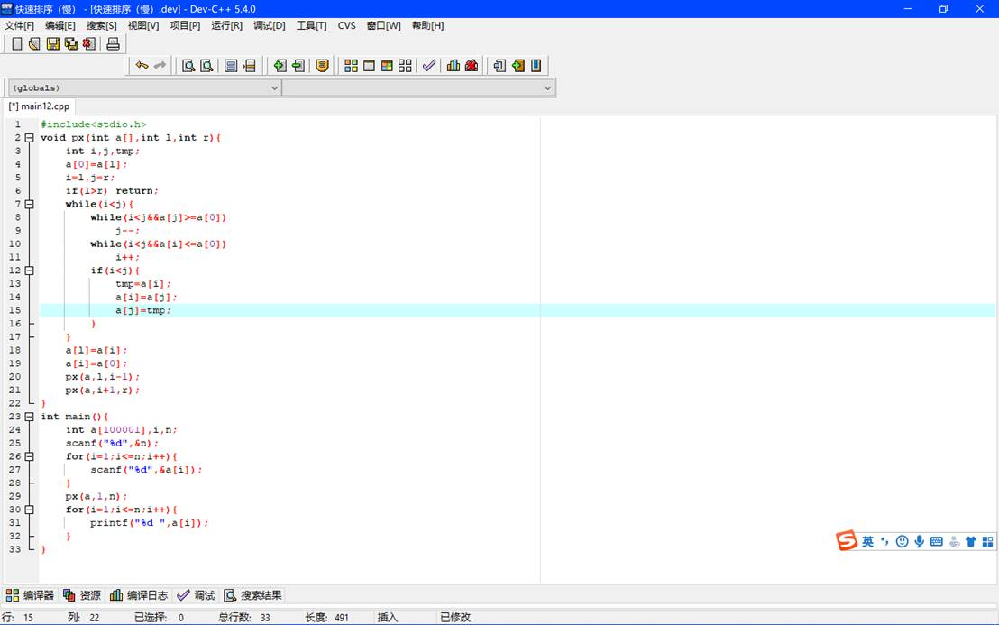
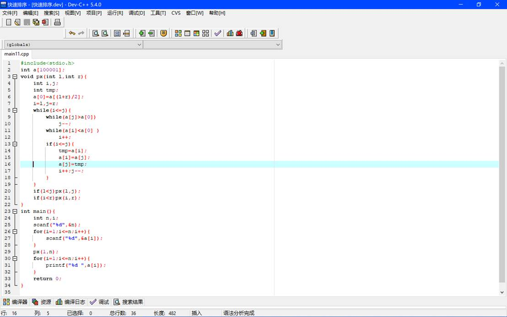
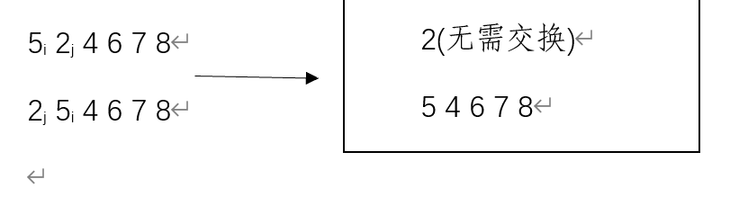
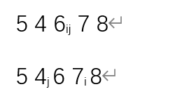
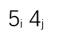
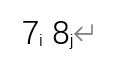
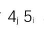
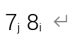
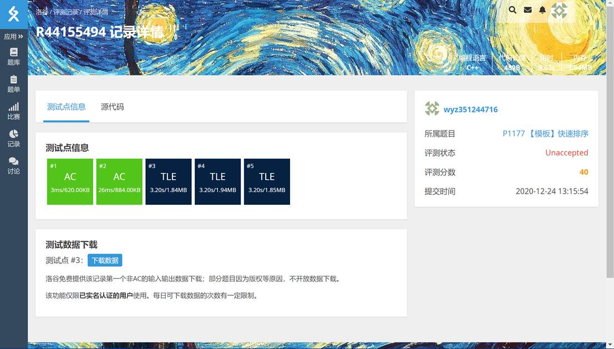
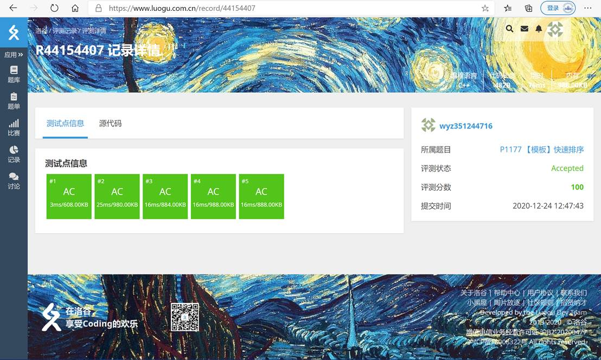

# 今日完成学习任务：

## 快速排序以及其优化思路

上图为常规的快速排序算法

以左端点为基准数，先从右向左找到一个比基准数小的数记此时下标为j，再从左向右找到一个比基准数大的数，记下标为i。交换此时的a[i],a[j]的指针，再循环至i，j相遇，则此时a[j]的值应是大于基准数的（因为j先动）a[i]应是比基准数小的数，而且经过一轮循环小于等于i部分的值一定是小于基准值的，大于等于j的部分一定是大于基准值的，那么此时a[i]与基准值位置交换（若与a[j]交换，则左边的值一定不是全小于中间值的了，那么刚刚一轮的交换将无效了）此时能保证小于i的部分全部小于a[i],大于i(大于等于j)的部分是大于a[i]的，因此a[i]的排名可以确定了此时a[i]不管，将数组分成1到i-1和i+1（j）到n两个部分，再循环往复地重复以上操作，就可以确定每个值的排名了，至此，排序全部完成，时间复杂度为O（n2）

 

 

上图为优化后的快速排序算法。

与基本的快速排序算法不同，此算法以中间值为基准值，首先选定中间值为基准值a[0]=a[(l+r)/2]，然后先从左端点开始，从左至右寻找一个大于基准值的a[i]定位，再从右端点开始从右至左寻找一个小于基准值的a[j]定位，如果全部找到了，那么就将a[i]与a[j]换位,同时i继续向右移动一位，j向左移动一位（这样能保证全部交换完毕后i在基准值右边，j在基准值左边，从而接下来可以把他分成两个部分再次递归进行排序） 

比如如下数

接下来只要对5 4 6 7 8进行交换即可

那么此时6为基准数，位置是正确的

最后变为  和  

转换变为和 

交换全部完成

结果为2 4 5 6 7 8

这是第一种算法在洛谷中的运行结果，虽然通过了，但是超时了

这是第二种算法在洛谷中的运行结果，为全部通过

