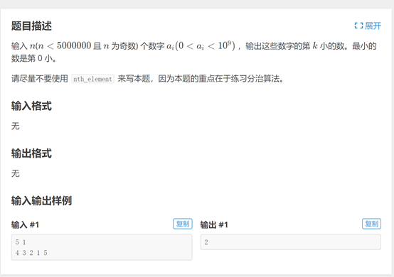
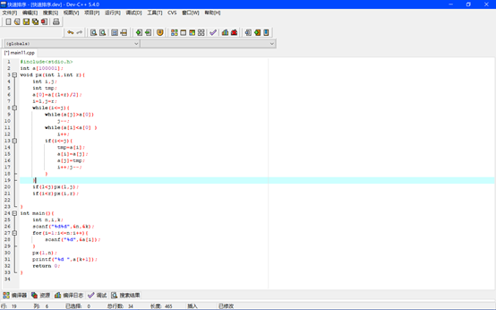
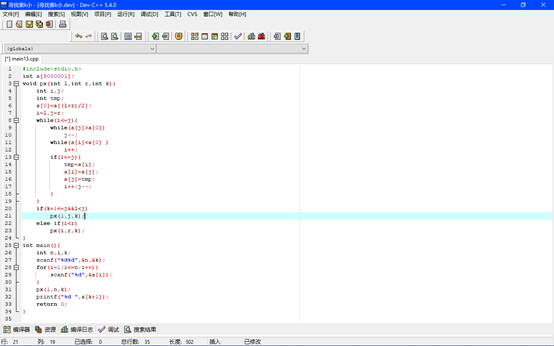
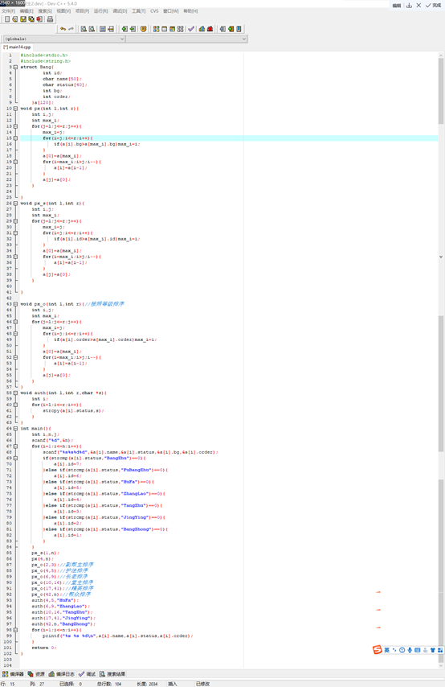
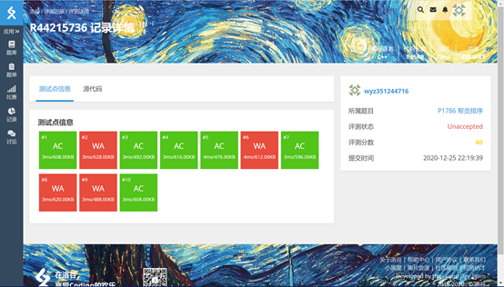

# 今日学习内容：

## 快速排序算法思路的扩展应用

### 1.寻找k小数         

昨天学习了快速排序，快速排序就是将中间数（基准数）先定位，然后交换左右两边的数，使左边的数恒小于基准数，右边恒大于基准数，将一组数分成两组再如此往复，最后分到最后一步时，整组数将完成排序，算法时间复杂度为O（n2）。

今天这道题的思路，首先想到将整组数从小到大排序，然后输出第k+1个数即可，于是代码如下

 

运行结果如下

 

发现超时了，时间超出了0.04s

分析其原因，可知我们只是要寻找到第k小的位置，而此代码却将整个数组进行了排序，因此时间复杂度过高，由此，我们决定从快速排序的基本思想：二分法 出发，先每次定位基准数的位置，只要k小数在基准数左边，则只对左边的一部分进行循环操作，否则，对右边进行操作，由此可以将每次操作次数降低一半，算法时间复杂度变为O（  ），代码如下：

 

运行结果如下：

 

至此结束

### 2.结构体排序

题目如下：

 

代码如下：

 

运行结果如下：

 

有四种情况暂时未过ac，情况暂不知晓。题目有待后续继续研究