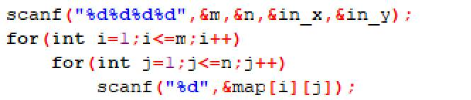
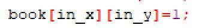

# 今日学习内容：

## 求岛面积（使用深搜和广搜）

### 题目


看到题目，我们知道这道题的目的就是不重复的走遍这个岛的每一个点，所以我们想到的算法是广度搜索算法。

常规的，我们先定义一个队列数组：


然后是一般的需要的数据定义：


输入：



初始坐标已经走过，所以标记上：



给这个初始地址加入队首，并将队尾长度加一方便下一个存储：


此时已经知道所处的地方是岛屿了：


接下来循环条件就是要走遍所有方向,判断某个方向是否可行，可行就入队，并给面积加一，最后这个点的四个方向都找完以后，队首出队：


循环结束条件是全部路都走完：


至此搜索结束。运行结果如下：


代码如下：

```c++
#include<stdio.h>
/*
10 10 6 8
1 2 1 0 0 0 0 0 2 3
3 0 2 0 1 2 1 0 1 2
4 0 1 0 1 2 3 2 0 1
3 2 0 0 0 1 2 4 0 0
0 0 0 0 0 0 1 5 3 0
0 1 2 1 0 1 5 4 3 0
0 1 2 3 1 3 6 2 1 0
0 0 3 4 8 9 7 5 0 0
0 0 0 3 7 8 6 0 1 2
0 0 0 0 0 0 0 0 1 0
*/
struct que{
   int x;
   int y;
};
struct que q[1600];
int tmp_x,tmp_y;//暂时存储坐标 
int m,n;//地图长宽 
int in_x,in_y;//初始坐标 
int map[40][40];//地图 
int dir[4][2]={{1,0},{0,1},{-1,0},{0,-1}};//打表方向 
int book[40][40]={0};//标记 
int s=0;//面积 
int head=1,tail=1;//队列头尾 
int main(){
   scanf("%d%d%d%d",&m,&n,&in_x,&in_y);
   for(int i=1;i<=m;i++)
       for(int j=1;j<=n;j++)
           scanf("%d",&map[i][j]);
   book[in_x][in_y]=1;    
   q[head].x=in_x;
   q[head].y=in_y;
   tail++;
   s++;
   while(head<tail){
      for(int i=0;i<4;i++){
         tmp_x=q[head].x+dir[i][0];
         tmp_y=q[head].y+dir[i][1];
         if(tmp_x>=1&&tmp_x<=n&&tmp_y>=1&&tmp_y<=m&&map[tmp_y][tmp_x]!=0&&book[tmp_x][tmp_y]==0){
            book[tmp_x][tmp_y]=1;
            q[tail].x=tmp_x;
            q[tail].y=tmp_y;
            s++;
            tail++;
         }
      }
      head++;
   }    
   printf("%d",s);  
   return 0;
} 

```


这道题目还可以用深搜的方法完成：

同样的，地图数组，标记数组，方向表：


常规的输入：


然后是深搜算法，每到一个点，以这个点为起点向四个方向的点出发，并判断是否可以走过去，如果可以就继续以这个点为起点出发，如此往复，找完以后再回来，但是，这里有个不一样的地方：这次要将所有搜到过的点标记为-1，就相当于将这块土地“染色”了，这就是染色法：


然后记得标记出发点：


最后我们将整个地图输出出来看一下效果：


运行结果：


下面这个就是染色后的地图数据：


我们可以看出，-1就是这整个岛的地界，这个我们只要用循环得到-1的数量就可以获得面积了。

最后代码如下：

```c++
#include<stdio.h>
int map[40][40];
int dir[4][2]={{1,0},{0,1},{-1,0},{0,-1}};
int book[40][40]={0};
int m,n,in_x,in_y;
int tmp_x,tmp_y;
void deep_s(int x,int y){
    for(int i=0;i<4;i++){
        tmp_x=x+dir[i][0];
        tmp_y=y+dir[i][1];
        if(tmp_x>=1&&tmp_x<=n&&tmp_y>=1&&tmp_y<=m&&book[tmp_x][tmp_y]==0&&map[tmp_y][tmp_x]!=0){
            book[tmp_x][tmp_y]=1;
            map[tmp_y][tmp_x]=-1;
            deep_s(tmp_x,tmp_y);
            book[tmp_x][tmp_y]=0;
        }
    }
}
int main(){
    scanf("%d%d",&m,&n);
    for(int i=1;i<=m;i++)
        for(int j=1;j<=n;j++)
            scanf("%d",&map[i][j]);
    book[in_x][in_y]=1;
    deep_s(in_x,in_y);
    for(int i=1;i<=m;i++){
        for(int j=1;j<=n;j++) printf("%3d",map[i][j]);
        printf("\n");
    }
    return 0;
}
/*
10 10 6 8
1 2 1 0 0 0 0 0 2 3
3 0 2 0 1 2 1 0 1 2
4 0 1 0 1 2 3 2 0 1
3 2 0 0 0 1 2 4 0 0
0 0 0 0 0 0 1 5 3 0
0 1 2 1 0 1 5 4 3 0
0 1 2 3 1 3 6 2 1 0
0 0 3 4 8 9 7 5 0 0
0 0 0 3 7 8 6 0 1 2
0 0 0 0 0 0 0 0 1 0
*/

```

这个算法还有个好处，就是我们可以判断岛的数量，以及每个岛的面积。

其中的

```c++
book[in_x][in_y]=1;
deep_s(in_x,in_y);
```


  改成

```c++
for(int i=1;i<=m;i++){
    for(int j=1;j<=n;j++){
        if(map[i][j]>0){
        dao_num++;
        deep_s(j,i,-(dao_num));
        }
    }
}
```

运行结果如下：


最后地图被染色成这样：


这样岛屿的个数和各自的面积只要用循环进行计算一下就能得到。

完整代码如下：

```c++
#include<stdio.h>
int map[40][40];
int dir[4][2]={{1,0},{0,1},{-1,0},{0,-1}};
int book[40][40]={0};
int m,n,in_x,in_y;
int tmp_x,tmp_y;
int dao_num=0;
void deep_s(int x,int y,int num){
    for(int i=0;i<4;i++){
        tmp_x=x+dir[i][0];
        tmp_y=y+dir[i][1];
        if(tmp_x>=1&&tmp_x<=n&&tmp_y>=1&&tmp_y<=m&&book[tmp_x][tmp_y]==0&&map[tmp_y][tmp_x]!=0){
            book[tmp_x][tmp_y]=1;
            map[tmp_y][tmp_x]=num;
            deep_s(tmp_x,tmp_y,num);
            book[tmp_x][tmp_y]=0;
        }
    }
}
int main(){
    scanf("%d%d",&m,&n);
    for(int i=1;i<=m;i++)
        for(int j=1;j<=n;j++)
            scanf("%d",&map[i][j]);
    for(int i=1;i<=m;i++){
        for(int j=1;j<=n;j++){
            if(map[i][j]>0){
                dao_num++;
                deep_s(j,i,-(dao_num));
            }
        }
    }
    for(int i=1;i<=m;i++){
        for(int j=1;j<=n;j++) printf("%3d",map[i][j]);
        printf("\n");
    }
    return 0;
}
/*
10 10
1 2 1 0 0 0 0 0 2 3
3 0 2 0 1 2 1 0 1 2
4 0 1 0 1 2 3 2 0 1
3 2 0 0 0 1 2 4 0 0
0 0 0 0 0 0 1 5 3 0
0 1 2 1 0 1 5 4 3 0
0 1 2 3 1 3 6 2 1 0
0 0 3 4 8 9 7 5 0 0
0 0 0 3 7 8 6 0 1 2
0 0 0 0 0 0 0 0 1 0
*/
```

