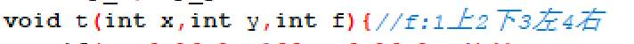

# 今日学习内容：

## 水管工游戏

### 题目


### 分析

根据题意，我们的管道总共有两种，可以变成六种排列方式：


其中1,2,3,4是可以互相转换的，5,6也是可以互相转换的，但是准换的前提是能与前一个连通。所以当前步骤的管道能转化成的排列方式完全是由上一个出水口的方向决定的：

因为每次管道的排列方式只能决定一种流水的方向，因此我们优先想到使用深度优先搜索算法：

定义函数时还要将上一步的流水方向也作为参数传入：



接下来，我们需要区分两种不同的管道做对应的操作：


我们先举一个特例：

假设我们现在操作的这一步是第一种弯曲的水管，假设水此时是从上方的管道流下来的，那么我们此时有两种排列方式选择，一种是向左的管道4,：，还有一种是向右弯曲的管道1：，所以我们分两种情况往下递归：


往下可以走通的条件是，没有越界，而且没有碰到树（树用0表示），也没有走回标记过的管道：


如果走得通，那就标记这个管道并开始下一个管道的操作，操作完以后还要退回这个情况：


那么弯管的假设已经结束，直管的假设就简单一些了，如下图：


最后我们结束查找的条件是找到了到达最后一个管道的情况，而且此时这个管道能连到右边的出水口：

所以当最后一个管道是弯管时：


是直管时：


这样，一个进水口到排水口的管道就连接完成了：

运行结果如下：


完整代码如下：

```c++
#include<bits/stdc++.h>
int map[40][40];
int book[40][40]={0};
int m,n;
int tmp_x,tmp_y;
void t(int x,int y,int f){//f:1上2下3左4右 
   if(map[y][x]>=1&&map[y][x]<=4){
      if(x==n&&y==m&&(f==1||f==2)){
           for(int i=1;i<=m;i++){
              for(int j=1;j<=n;j++){
                 if(book[j][i]==1){
                    printf("(%d,%d) ",j,i);
                 }
              }
           }
           printf("\n");
           return; 
        }
      if(f==1){
          tmp_x=x+1,tmp_y=y;//1号管 
          if(tmp_x>=1&&tmp_x<=n&&tmp_y>=1&&tmp_y<=m&&book[tmp_x][tmp_y]==0&&map[tmp_y][tmp_x]!=0){
             book[tmp_x][tmp_y]=1;
             t(tmp_x,tmp_y,3);
             book[tmp_x][tmp_y]=0;
          }
          tmp_x=x-1,tmp_y=y;//4号管 
          if(tmp_x>=1&&tmp_x<=n&&tmp_y>=1&&tmp_y<=m&&book[tmp_x][tmp_y]==0&&map[tmp_y][tmp_x]!=0){
             book[tmp_x][tmp_y]=1;
             t(tmp_x,tmp_y,4);
             book[tmp_x][tmp_y]=0;
          }
      }
      if(f==2){
         tmp_x=x+1,tmp_y=y;//2号管 
          if(tmp_x>=1&&tmp_x<=n&&tmp_y>=1&&tmp_y<=m&&book[tmp_x][tmp_y]==0&&map[tmp_y][tmp_x]!=0){
             book[tmp_x][tmp_y]=1;
             t(tmp_x,tmp_y,3);
             book[tmp_x][tmp_y]=0;
          }
          tmp_x=x-1,tmp_y=y;//3号管 
          if(tmp_x>=1&&tmp_x<=n&&tmp_y>=1&&tmp_y<=m&&book[tmp_x][tmp_y]==0&&map[tmp_y][tmp_x]!=0){
             book[tmp_x][tmp_y]=1;
             t(tmp_x,tmp_y,4);
             book[tmp_x][tmp_y]=0;
          }
      }
      if(f==3){
         tmp_x=x,tmp_y=y+1;//3号管 
          if(tmp_x>=1&&tmp_x<=n&&tmp_y>=1&&tmp_y<=m&&book[tmp_x][tmp_y]==0&&map[tmp_y][tmp_x]!=0){
             book[tmp_x][tmp_y]=1;
             t(tmp_x,tmp_y,1);
             book[tmp_x][tmp_y]=0;
          }
          tmp_x=x,tmp_y=y-1;//4号管 
          if(tmp_x>=1&&tmp_x<=n&&tmp_y>=1&&tmp_y<=m&&book[tmp_x][tmp_y]==0&&map[tmp_y][tmp_x]!=0){
             book[tmp_x][tmp_y]=1;
             t(tmp_x,tmp_y,2);
             book[tmp_x][tmp_y]=0;
          }
      }
      if(f==4){
         tmp_x=x,tmp_y=y-1;//1号管 
          if(tmp_x>=1&&tmp_x<=n&&tmp_y>=1&&tmp_y<=m&&book[tmp_x][tmp_y]==0&&map[tmp_y][tmp_x]!=0){
             book[tmp_x][tmp_y]=1;
             t(tmp_x,tmp_y,2);
             book[tmp_x][tmp_y]=0;
          }
          tmp_x=x,tmp_y=y+1;//2管 
          if(tmp_x>=1&&tmp_x<=n&&tmp_y>=1&&tmp_y<=m&&book[tmp_x][tmp_y]==0&&map[tmp_y][tmp_x]!=0){
             book[tmp_x][tmp_y]=1;
             t(tmp_x,tmp_y,1);
             book[tmp_x][tmp_y]=0;
          }
      }
   }
   if(map[y][x]>=5&&map[y][x]<=6){
      if(x==n&&y==m&&f==3){
           for(int i=1;i<=m;i++){
              for(int j=1;j<=n;j++){
                 if(book[j][i]==1){
                    printf("(%d,%d) ",j,i);
                 }
              }
           }
           printf("\n");
           return; 
        }
      if(f==1){
          tmp_x=x,tmp_y=y+1;//6号管 
          if(tmp_x>=1&&tmp_x<=n&&tmp_y>=1&&tmp_y<=m&&book[tmp_x][tmp_y]==0&&map[tmp_y][tmp_x]!=0){
             book[tmp_x][tmp_y]=1;
             t(tmp_x,tmp_y,1);
             book[tmp_x][tmp_y]=0;
          }
      }
      if(f==2){
          tmp_x=x,tmp_y=y-1;//6号管 
          if(tmp_x>=1&&tmp_x<=n&&tmp_y>=1&&tmp_y<=m&&book[tmp_x][tmp_y]==0&&map[tmp_y][tmp_x]!=0){
             book[tmp_x][tmp_y]=1;
             t(tmp_x,tmp_y,2);
             book[tmp_x][tmp_y]=0;
          }
      }
      if(f==3){
          tmp_x=x+1,tmp_y=y;//5号管 
          if(tmp_x>=1&&tmp_x<=n&&tmp_y>=1&&tmp_y<=m&&book[tmp_x][tmp_y]==0&&map[tmp_y][tmp_x]!=0){
             book[tmp_x][tmp_y]=1;
             t(tmp_x,tmp_y,3);
             book[tmp_x][tmp_y]=0;
          }
      }
      if(f==4){
          tmp_x=x-1,tmp_y=y;//5号管 
          if(tmp_x>=1&&tmp_x<=n&&tmp_y>=1&&tmp_y<=m&&book[tmp_x][tmp_y]==0&&map[tmp_y][tmp_x]!=0){
             book[tmp_x][tmp_y]=1;
             t(tmp_x,tmp_y,4);
             book[tmp_x][tmp_y]=0;
          }
      }
   }
}
int main(){
   scanf("%d%d",&m,&n);
   for(int i=1;i<=m;i++)
       for(int j=1;j<=n;j++)
           scanf("%d",&map[i][j]);
   book[1][1]=1;        
   t(1,1,3);        
   return 0;
}
/*
5 4
5 3 5 3
1 5 3 0
2 3 5 1
6 1 1 5
1 5 5 4
*/

```

### 简化代码

当然，如果将标记与判断下一步能否走通交给下一步来进行，也就是说判断这一步能否走通，会让代码量大大减少，像这样：


当然，此时在主函数中也就无需再给初位置标记了，完整代码如下：

```c++
#include<bits/stdc++.h>
int map[40][40];
int book[40][40]={0};
int m,n;
int tmp_x,tmp_y;
void t(int x,int y,int f){//f:1上2下3左4右 
    if(x<1||x>n||y<1||y>m) return;
    if(book[x][y]==1||map[y][x]==0) return;
    book[x][y]=1;
    if(map[y][x]>=1&&map[y][x]<=4){
        if(x==n&&y==m&&(f==1||f==2)){
            for(int i=1;i<=m;i++){
                for(int j=1;j<=n;j++){
                    if(book[j][i]==1){
                        printf("(%d,%d) ",j,i);
                    }
                }
            }
            printf("\n");
            return;
        }
        if(f==1){
            t(x+1,y,3);
            t(x-1,y,4);
        }
        if(f==2){
            t(x+1,y,3);
            t(x-1,y,4);
        }
        if(f==3){
            t(x,y+1,1);
            t(x,y-1,2);
        }
        if(f==4){
            t(x,y-1,2);
            t(x,y+1,1);
        }
    }
    if(map[y][x]>=5&&map[y][x]<=6){
        if(x==n&&y==m&&f==3){
            for(int i=1;i<=m;i++){
                for(int j=1;j<=n;j++){
                    if(book[j][i]==1){
                        printf("(%d,%d) ",j,i);
                    }
                }
            }
            printf("\n");
            return;
        }
        if(f==1){
            t(x,y+1,1);
        }
        if(f==2){
            t(x,y-1,2);
        }
        if(f==3){
            t(x+1,y,3);
        }
        if(f==4){//5号管 
            t(x-1,y,4);
        }
    }
    book[x][y]=0;
}
int main(){
    scanf("%d%d",&m,&n);
    for(int i=1;i<=m;i++)
        for(int j=1;j<=n;j++)
            scanf("%d",&map[i][j]);
    t(1,1,3);
    return 0;
}
/*
5 4
5 3 5 3
1 5 3 0
2 3 5 1
6 1 1 5
1 5 5 4
*/
 
```

可见，代码量确实少了许多。