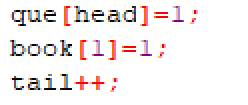

# 今日学习内容：

# 图的遍历：

# 深度优先和广度优先是什么

### 图

要搞清楚什么是深度优先和广度优先，那么我们先得搞懂什么是图：

图就是由多个顶点和边组成的：


而遍历就是想办法将所有的顶点都访问一遍，比如使用深度优先算法，他会沿着一条路线一直走下去，直到走不通才回来继续寻找，所以使用深度优先会遍历出如下结果：


（直线代表的是走过的路径）

我们来深入理解一下深度优先遍历：深度优先遍历的主要思想是首先以一个从未被访问过的顶点为起始点，沿着这个点去寻找从未访问过的点，如果找不到这个点就返回上一个顶点继续寻找，通过这个步骤，我们就可以走完图中每一个可以走的点顶点

图的存储一般是使用二维数组，因为如果想要遍历一个图的话，我们首先需要知道哪两个图之间存在着连接关系，比如上面的图转化成二维数组如下：


其中，0表示这两个点是一个点，1表示两个点之间有连接，其他的表示两点之间没有边。

所以我们在遍历图的时候，需要先进行一个边的录入工作：


（二维表是对于对角线对称的）

### 深度优先遍历

然后开始深度搜索算法：


由于我们在遍历时，每个数字只遍历一次，所以不需要返回上一步，否则会造成在结点位置输出两次的情况，最后每次遍历的时候都进行一边输出，代码就完成了。

最后代码运行如下：


完整代码如下：

```c++
#include<bits/stdc++.h>
int a[50][50]={0};
int book[50]={0};
int n,m;
int p,q;
void t(int start){
   printf("%d ",start);
   for(int i=1;i<=n;i++){
      if(a[start][i]==1&&book[i]==0){
         book[i]=1;
         t(i);
      }
   }
}
int main(){
   scanf("%d%d",&n,&m);
   for(int i=1;i<=m;i++){
      scanf("%d%d",&p,&q);
      a[p][q]=1;
      a[q][p]=1;
   }
   book[1]=1;
   t(1);
   return 0;
} 
/*
5 5
1 2
1 3
1 5
2 4
3 5
*/

```

### 广度优先遍历

接下来就是广度优先遍历：

同样的，需要先打表：


然后，广度优先算法我们需要用到队列来进行：


接着我们先把开始遍历的那个数放到队首，给队尾加上1供下一位存入，还要标记当前点已经访问结束以防止重复访问：



然后我们开始从第一个数开始遍历：从第一个数开始遍历那些跟它相连接的数，如果下面的数跟这个数有连接而且被标记没有访问过，就将这个数存入队尾并标记上，再输出，还要给队尾+1：


这跟广度优先搜索算法是一样的。

至此就结束了，运行结果如下：


完整代码如下：

```c++
#include<bits/stdc++.h>
int a[50][50]={0};
int book[50]={0};
int que[1000];
int head=1,tail=1;
int n,m;
int p,q;
int main(){
    scanf("%d%d",&n,&m);
    for(int i=1;i<=m;i++){
        scanf("%d%d",&p,&q);
        a[p][q]=1;
        a[q][p]=1;
    }
    que[head]=1;
    book[1]=1;
    tail++;
    printf("%d ",que[head]);
    while(head<tail){
        for(int i=1;i<=n;i++){
            if(book[i]==0&&a[que[head]][i]==1){
                book[i]=1;
                que[tail]=i;
                printf("%d ",i);
                tail++;
            }
        }
        head++;
    }
    return 0;
}
/*
5 5
1 2
1 3
1 5
2 4
3 5
*/
```

 