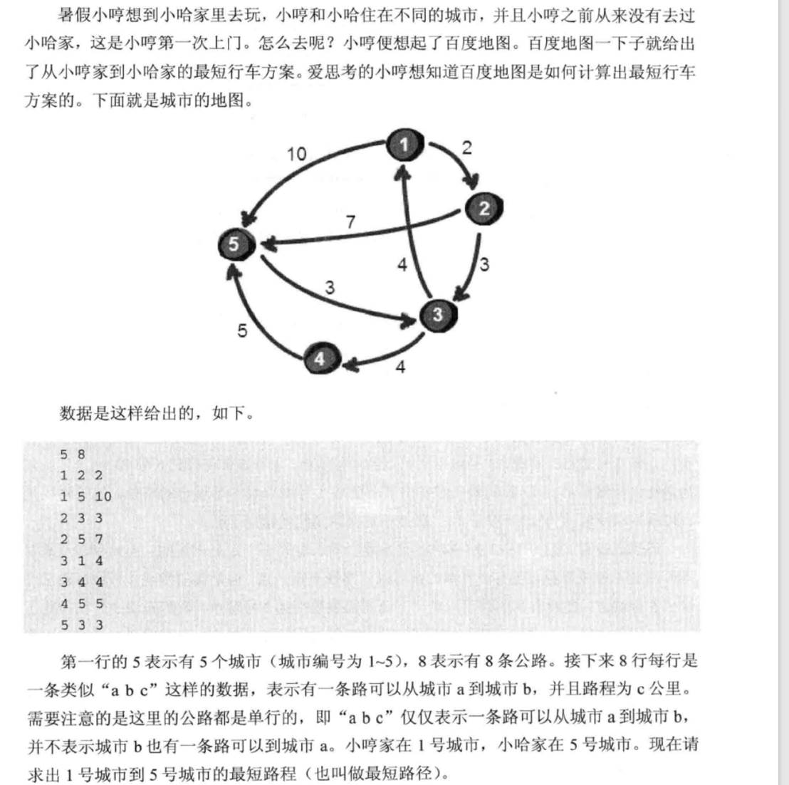
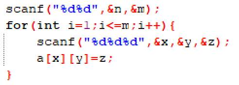
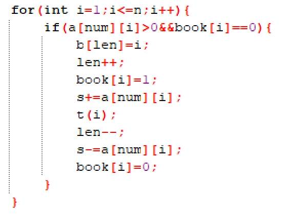
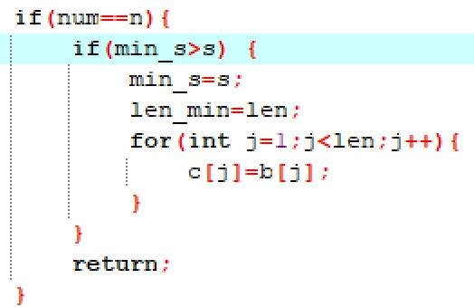
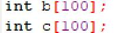
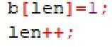
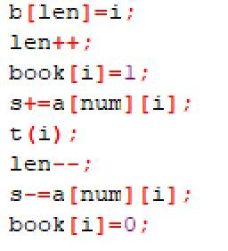
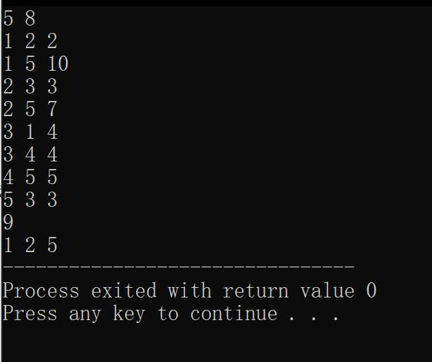

# 今日学习内容：

## 城市地图（寻找最短路线）

### 题目



首先观察这个图，是十分混乱的，虽然信息都包含在里面的，可是关系混乱。

所以这里我们用代码来解决最短路径的问题。

首先，我们先思考使用深度优先还是广度优先。既然这里寻找的是最短路径，那么我们优先选用深度优先搜索。

那么首先，这次的图是有向图，所以我们要用有向二维表来存储图的数据。

二维表的输入如下：



然后就是标记第一个点已经走过：


接着就是普通的深搜办法：



在搜索完成以后，再用一个打擂台算法求出最小值：



在这里我将代码改变了一下，以使得他可以存储一个路径，这里使用了栈这个数据结构，就是将每一步的路径存入一个数组之中，如果这个路径最短则将这个存储路径的数组存入另一个数组以便于后续输出。在这里我们先定义栈顶为1，预定义一个最小路径对应的len存储最小路径时的经过城市个数：


然后是两个数组：



先将第一个城市入栈：



然后每次尝试都将尝试的城市入栈，返回上一步就将当前城市出栈：



最后运行结果如下：



完整代码如下：

```c++
#include<stdio.h>
int b[100];
int c[100];
int len=1,len_min;
int map[40][40];
int a[100][100]={0};
int n,m;
int x,y,z;
int s=0,min_s=99999;
int book[100]={0};
void t(int num){
   if(num==n){
      if(min_s>s) {
          min_s=s;
          len_min=len;
          for(int j=1;j<len;j++){
             c[j]=b[j];
          }
       }
      return;
   }
   for(int i=1;i<=n;i++){
      if(a[num][i]>0&&book[i]==0){
         b[len]=i;
         len++; 
         book[i]=1;
         s+=a[num][i];
         t(i);
         len--;
         s-=a[num][i];
         book[i]=0;
      }
   }
} 
int main(){
   scanf("%d%d",&n,&m);
   for(int i=1;i<=m;i++){
      scanf("%d%d%d",&x,&y,&z);
      a[x][y]=z;
   }
   book[1]=1;
   b[len]=1;
   len++;
   t(1);
   printf("%d\n",min_s);
   for(int i=1;i<len_min;i++){
      printf("%d ",c[i]);
   }
   return 0;
} 
/*
5 8
1 2 2
1 5 10
2 3 3
2 5 7
3 1 4
3 4 4
4 5 5
5 3 3
*/

```

