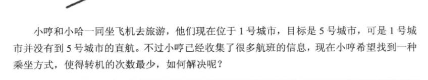
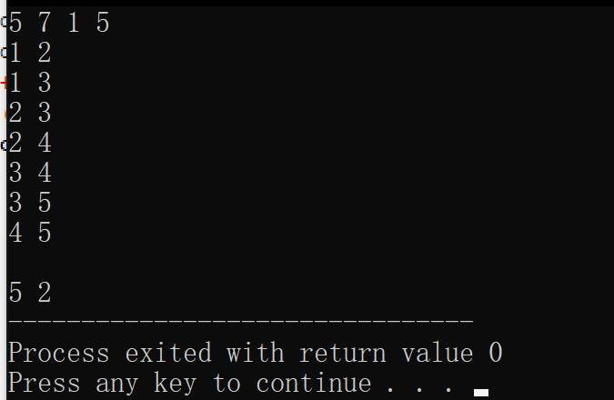
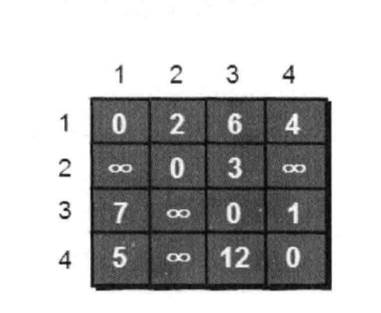
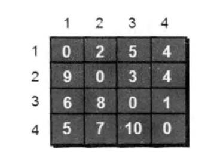
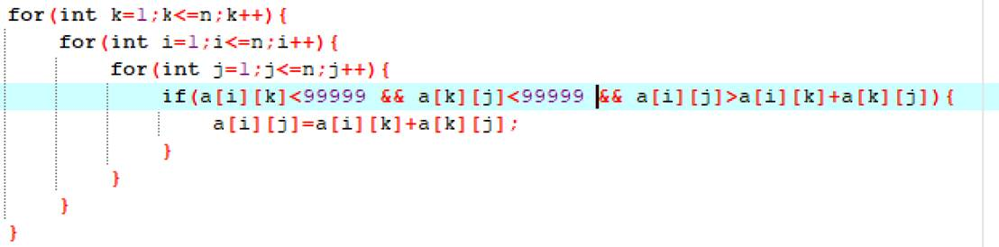
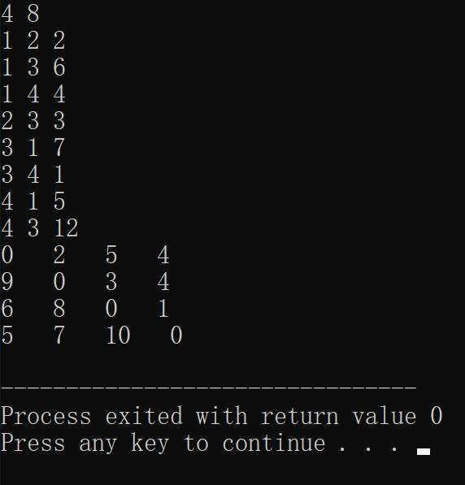

# 今日学习内容：

## 最少转机（广度优先算法的实际应用）与floyd-warshall算法

### 1.最少转机

#### 题目



看到题目并加以分析就知道是一道常规的广度优先遍历题，注意结束条件和输出tail-1就行了：

最终代码如下：

```c++
#include<stdio.h>
int main(){
   struct que{
      int s;
      int x;
   }t[100];
   int p,q;
   int m,n,from,to,flag=0;
   int head=1,tail=1;
   int a[40][40]={0};
   int book[100]={0};
   scanf("%d%d%d%d",&n,&m,&from,&to);
   for(int i=1;i<=m;i++){
      scanf("%d%d",&p,&q);
      a[p][q]=1;
      a[q][p]=1;
   }
   book[from]=1;
   t[head].s=0;
   t[head].x=from;
   tail++;
   while(head<tail){
      for(int i=1;i<=n;i++){
         if(t[tail-1].x==to){
            flag=1;
            break;
         }
         if(book[i]==0&&a[t[head].x][i]>0){
            book[i]=1;
            t[tail].x=i;
            t[tail].s=t[head].s+1;
            tail++;
         }
         
      }
      head++;
      if(flag==1){
         break;
      }
   }
   printf("\n%d %d",t[tail-1].x,t[tail-1].s);
   return 0;
} 
/*
5 7 1 5
1 2 
1 3
2 3
2 4
3 4
3 5
4 5
*/

```


运行结果如下：



### 2.floyd-warshall算法求最短路径

#### 概念

我们在处理旅游时行程规划问题时，经常会碰到需要求几个城市之间最短旅程的规划方案的问题，这时候，有些城市之间是单行道，有些城市之间来往行程不同，这时候我们就需要将所有城市间的最短路径求出以便于规划路径。

原理：两个城市间的路程有可能会大于两个城市经过一个中转城市来往的路程总和，所以，我们要寻找出任意两个城市直接的最短路程，就要判断它们中间以某另一个城市中转的路程之和是否小于这两个城市之间直接的路程，如果是的话，我们就更新这两个城市之间的路程为最短的那个，而有些城市之间是单向可行的，所以可以当做这两个城市之间的距离之和为正无穷，然后再寻求中转站来缩短两个城市之间的路程，用打表的方式来进行的话，就是将



转化成



而转化过程之中最核心的代码就是floyd-warshall算法，算法如下：



就是通过循环来将代码路程优化

运行结果如下：



最终代码如下：

```c++
#include<bits/stdc++.h>
int main(){
   int n,m;
   int p,q,t;
   int a[40][40]={0};
   scanf("%d%d",&n,&m);
   for(int i=1;i<=n;i++){
      for(int j=1;j<=n;j++){
         if(i==j)a[i][j]=0;
         else a[i][j]=99999;
      }
   }
   for(int i=1;i<=m;i++){
      scanf("%d%d%d",&p,&q,&t);
      a[p][q]=t;
   }
   for(int k=1;k<=n;k++){
      for(int i=1;i<=n;i++){
         for(int j=1;j<=n;j++){
            if(a[i][k]<99999 && a[k][j]<99999 && a[i][j]>a[i][k]+a[k][j]){
               a[i][j]=a[i][k]+a[k][j];
            }
         }
      }
   }
   
   for(int i=1;i<=n;i++){
      for(int j=1;j<=n;j++){
         printf("%d   ",a[i][j]);
      }
      printf("\n");
   }
   return 0;
} 
/*
4 8
1 2 2
1 3 6
1 4 4
2 3 3
3 1 7
3 4 1
4 1 5
4 3 12
*/


```


 