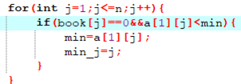
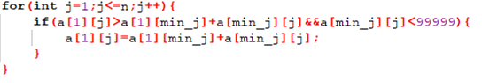
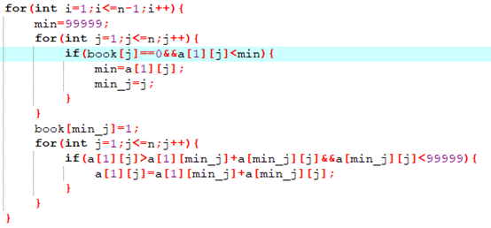
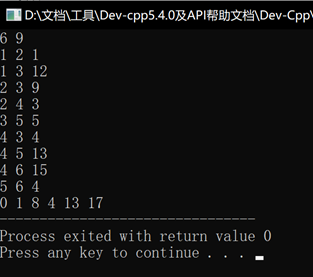

---

---

# 今日学习内容：

## Dijkstra算法（运用边的松弛）

### 背景

在上节求任意两顶点直接最短距离这种多源最短路径问题时，我们通常会使用floyd-warshall算法，但是若是我们只需要求得某个点到其他各点的距离这种单源最短路径问题时，我们若是还选用floyd-warshall算法的话，会造成时间复杂度过大，floyd-warshall算法的时间复杂度为O(N3)但是很明显，我们是可以降低它的时间复杂度到O（N2），这时候我们就需要dijkstra算法来降低其时间复杂度了。

### 原理

我们当寻求一个点到其他各点之间的最短距离时，我们可以先寻找离这个单点距离最近的一个点，这样我们可以确定下来这两个点之间最短路径，然后，和这个点可以直接相连的几个点目前的最短路径都可以确定下来，然后接着，我们沿着刚刚确定的最近的一个点往下走，那么从这个点出发可以直接连通的点的路径可以确定，这时候就可以比较更新第一个点到其他点的距离了，循环往复，就可以确定下来所有的点的最短路径。

那么根据以上原理，我们先设置最小值是99999以确保能进行打擂台算法：

接着我们就要寻找没走过的最近的点了：



然后给这个点做好标记，表示已经走过了：


然后通过这个点更新起始点到各个点直接的最短路径，即进行“松弛”：



循环往复，这就是Dijkstra算法的核心：



最终代码运行结果如下：



最终代码如下：

```c++
#include<bits/stdc++.h>
int main(){
   int a[40][40];
   int book[100]={0};
   int p1,p2,p3;
   int n,m,min,min_j;
   scanf("%d%d",&n,&m);
   for(int i=1;i<=n;i++)
       for(int j=1;j<=n;j++){
          if(i==j) a[i][j]=0;
          else a[i][j]=99999;
       }
   for(int i=1;i<=m;i++){
      scanf("%d%d%d",&p1,&p2,&p3);
      a[p1][p2]=p3;
   }   
   book[1]=1;   
   for(int i=1;i<=n-1;i++){
      min=99999;
      for(int j=1;j<=n;j++){
         if(book[j]==0&&a[1][j]<min){
            min=a[1][j];
            min_j=j;
         }
      }
      book[min_j]=1;
      for(int j=1;j<=n;j++){
         if(a[1][j]>a[1][min_j]+a[min_j][j]&&a[min_j][j]<99999){
            a[1][j]=a[1][min_j]+a[min_j][j];
         }
      }
   }
   for(int i=1;i<=n;i++){
      printf("%d ",a[1][i]);
   }
} 
/*
6 9
1 2 1
1 3 12
2 3 9
2 4 3
3 5 5
4 3 4
4 5 13
4 6 15
5 6 4
*/

```

## 邻接表

### 背景

对于图的存储，假设我们有总共有1000个顶点，而只有一条边，那么我们还是需要一个1000*1000的二维表来优化它，这无非是浪费了大量的内存空间，空间复杂度过大，而且，在遍历图时，时间复杂度也特别高，所以我们这里使用一个新的存储结构：邻接表来存储图的边。

### 原理

首先，我们定义一个队列来存储边：


然后定义一个next数组和first数组，first数组用来存储每个顶点对应的边中其中的一个边的下标，next数组用来存储每个有不止一条边的顶点的其他边的下标，我们存储的规则是：

1.结构体的下标对应的是我们输入的每个边，first数组中的下标对应的是我们每个顶点，next下标也对应我们输入的边。

2.如果我们输入了一个边，但是这个边初始的顶点还没有任何边录入时，我们就将这个边的下标存入到first数组之中，那么next中这个边对应的下标就不需要存储数据了。

3.如果我们输入的这条边，初始的顶点已经有对应的边录入时，那么我们就将这个已经有的边存入到对应下标的next数组之中，然后再把我们刚刚输入的边对应的下标存入以这个边起始顶点为下标的first数组中。

所以输入数据时，代码如下：


而读取数据时，我们先以某个顶点开始，找这个顶点对应的边的下标，用类似于链表的方式进行遍历：


最终代码运行结果如下：


最终代码如下:

```c++
#include<bits/stdc++.h>
int main(){
	struct t{
		int f;
		int t;
		int s;
	}q[100];
	int b1,b2,b3;
	int m,n,tmp;
	scanf("%d%d",&n,&m);
	int first[n+1];
	for(int i=0;i<=n;i++) first[i]=-1;
	int next[m+1];
	for(int i=1;i<=m;i++){
		scanf("%d%d%d",&b1,&b2,&b3);
		q[i].f=b1;
		q[i].t=b2;
		q[i].s=b3;
		next[i]=first[q[i].f];
		first[q[i].f]=i;
	}
	//for(int i=1;i<=n;i++) printf("%d",first[i]);
	printf("\n");
	for(int i=1;i<=n;i++){
		tmp=first[i];
		while(tmp!=-1){
			printf("%d %d %d\n",q[tmp].f,q[tmp].t,q[tmp].s);
			tmp=next[tmp];
		}
	}
	return 0;
} 
/*
4 
1 4 9
2 4 6
1 2 5
4 3 8
1 3 7
*/
```
