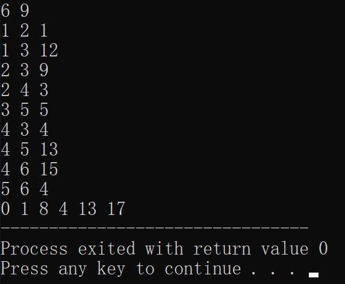

# 今日学习内容：

## 邻接表对算法的优化

昨天我们说到，用邻接表可以优化程序的空间复杂度，并在一定情况下可以优化程序的时间复杂度，今天我们来试着使用邻接表这种存储结构来优化程序。

### 1.邻接表和Dijkstra算法

昨天我们学习到，Dijkstra是一种针对单源最短路径模型的优化，但是如果使用二维表来存储图很可能会白白浪费大量空间，所以今天我们来尝试使用邻接表来存储图。

首先，我们要定义一个结构体数组来存储输入的边：

```c++
struct t{
	int f;//起始点 
	int t;//指向的点 
	int s;//路径长度 
}k[1000];
```

然后输入顶点个数和边的个数:

```c++
scanf("%d%d",&n,&m);
```

接着我们定义两个数组来表示邻接表，数组a的下标对应顶点，值指向数组b的下标和结构体数组k的下标，b的值指向下一个b数组的下标和对应的k数组的下标，其存储方式类似于链表。

```c++
int a[n+1];
int b[m+1];
```

初始化a数组：

```c++
for(int i=0;i<=n;i++) a[i]=-1;
```

接着我们定义一个一维数组来存储顶点1到各个顶点的最短距离：

```c++
int c[100]={0};
```

然后数组初始化：

```c++
for(int i=1;i<=n;i++){
	if(i!=1) c[i]=99999;
}
```

定义一个记录每个顶点是否都访问过的标记数组book：

```c++
int book[100]={0};
```

接着是通过邻接表存储数据：

```c++
for(int i=1;i<=m;i++){
	scanf("%d%d%d",&k[i].f,&k[i].t,&k[i].s);
	if(k[i].f==1) c[k[i].t]=k[i].s;
	b[i]=a[k[i].f];
	a[k[i].f]=i;
}
```

标记上第一个顶点：

```c++
book[1]=1;
```

然后开始进行Dijkstra算法的核心内容，在前面找距离第一个顶点最近的那个点时算法不变：

```c++
min=99999;
for(int j=1;j<=n;j++){
 	if(min>c[j] && book[j]==0){	
	   	min=c[j];
 	   	min_j=j;
  	}
}
book[min_j]=1;
```

接着不变的是的一个for循环找遍所有的点：

```c++
for(int j=1;j<=n;j++){
......		
}
```

但是在循环体中遍历数据的方式开始发生了改变：

首先，我们需要知道的是，我们现在已经有了**顶点1**到**顶点min_j**的**不确定**最短距离，接着按照Dijkstra算法的做法，我们需要找到**顶点min_j**到**顶点j**的不确定最短路径以确保能成功进行打擂台算法来更新权值，那么接下来的最大的问题就是找到**顶点min_j**到**顶点j**的不确定最短距离。

这时候我们就想到了邻接表的输出方式：

```c++
tmp=a[min_j];
while(tmp!=-1){
    printf("%d %d %d",k[tmp].f,k[tmp].t,k[tmp].s);
    tmp=b[tmp];
}
```

我们可以看出，这个代码可以输出从**顶点min_j**到其他各个顶点的边的起始顶点，指向顶点和边的长度，那么我们可以将代码修改一下，使其能够找到**顶点min_j**到**顶点j**的不确定最短路径：

```c++
min_s=99999;
tmp=a[min_j];
while(tmp!=-1){
    if(k[tmp].t==j){
	    min_s=k[tmp].s;
	    break;	
    }
	tmp=b[tmp];
}
```

这样就能找出**顶点min_j**到**顶点j**的不确定最短路径了。

然后我们通过打擂台算法就可以更新全部的权值了。

最后输出：

```c++
for(int i=1;i<=n;i++){
	printf("%d ",c[i]);
}
```

测试数据如下：

```
6 9
1 2 1
1 3 12
2 3 9
2 4 3
3 5 5
4 3 4
4 5 13
4 6 15
5 6 4
```

最终运行结果如下：



最终代码如下：

```c++
#include<bits/stdc++.h>
int main(){
	int n,m,min,min_j,min_s,tmp;
	struct t{
		int f;//起始点 
		int t;//指向的点 
		int s;//路径长度 
	}k[1000];
	scanf("%d%d",&n,&m);
	int a[n+1];
	int b[m+1];
	for(int i=0;i<=n;i++) a[i]=-1;
	int c[100]={0};
	for(int i=1;i<=n;i++){
		if(i!=1) c[i]=99999;
	}
	int book[100]={0};
	for(int i=1;i<=m;i++){
		scanf("%d%d%d",&k[i].f,&k[i].t,&k[i].s);
		if(k[i].f==1) c[k[i].t]=k[i].s;
		b[i]=a[k[i].f];
		a[k[i].f]=i;
	}
	book[1]=1;
	for(int i=1;i<=n-1;i++){
	    min=99999;
	    for(int j=1;j<=n;j++){
	    	if(min>c[j] && book[j]==0){	
	    	   	min=c[j];
	    	   	min_j=j;
	    	}
	    }
		book[min_j]=1;
		for(int j=1;j<=n;j++){
			min_s=99999;
			tmp=a[min_j];
			while(tmp!=-1){
				if(k[tmp].t==j){
					min_s=k[tmp].s;
					break;	
				}
				tmp=b[tmp];
			}
			if(c[j]>c[min_j]+min_s && min_s<99999)
			c[j]=c[min_j]+min_s;
		}
		
	}
	for(int i=1;i<=n;i++){
		printf("%d ",c[i]);
	}
	return 0;
} 
```

