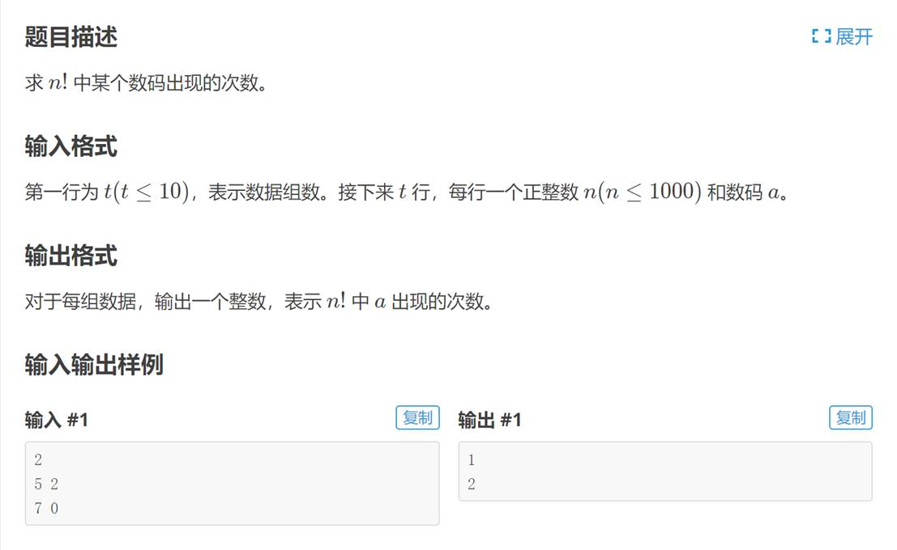
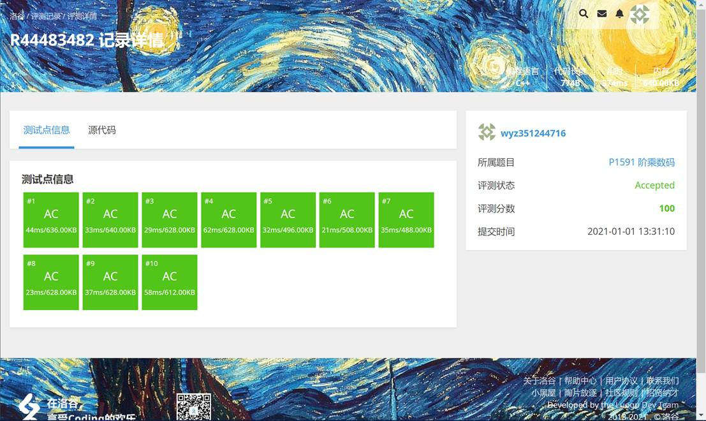

# 今日学习内容：

## 高精度阶乘的重新学习

### 高精度算法介绍

c语言中，最高的数字数据类型只能存储64位的数据，即最大只能储存2^64的数据，因此我们可以用数组存储数据，来模拟运算过程。

### 高精度加法

将两个输入的整数倒序，从第一位开始相加，若任何一位大于9，那就将多余的位数加到下一位，核心算法为：

sum[i]=a[i]+b[i];

sum[i+1]+=sum[i]/10;

sum[i]%=10;

最后再将整个数组倒序输出即可

### 高精度乘法

将两个输出的整数倒序存入到数组a,b中，首先从b的个位开始代入乘法，乘出来的数若是大于9则进一位加入到sum之中，核心算法为：

sum[i+j]=a[i]*b[j];

sum[i+j+1]=sum[i+j]/10;

sum[i+j]%=10;

### 题目：阶乘数码（高精度）

#### 题目



仔细分析题目，不难发现，n!已经远超2^64，而n的范围在1000以内，由此可知，这题目其实就是一道高精度乘以低精度的题目。

那么既然是高精度乘以低精度，那么就只需要将n！用数组来存储，数组记为sum1，第一个元素为1（需要参与乘法，如果初值为0则就无法进行乘法运算，无论如何结果一定是0）接下来循环将n乘以sum1.因为n为低精度，所以无需转化成数组。

每次乘法以后，要把多的位数存储到下一步

#### 核心代码

```c++
sum2[j]+=sum[j]*i;
t=j;
while(sum2[t]>9){
    sum2[t+1]+=sum2[t]/10;
    sum2[t]%=10;
    t++;
}
```

再将sum2的元素全部存进sum中，将sum初始化。

#### 最终代码

```c++
#include<stdio.h>
#include<string.h>
int main(){
    int n,sum_len=1,t,w,num=0,time;
    int sum[4000]={0};
    int sum2[4000]={0};
    sum[1]=1,sum2[1]=0;
    scanf("%d",&time);
    for(int p=0;p<time;p++){
        scanf("%d%d",&n,&w);
        for(int i=1;i<=n;i++){
            for(int j=1;j<=sum_len;j++){
                sum2[j]+=sum[j]*i;
                t=j;
                while(sum2[t]>9){
                    sum2[t+1]+=sum2[t]/10;
                    sum2[t]%=10;
                    t++;
                }
                if(t>sum_len)sum_len=t;
            }
            for(int j=1;j<=sum_len;j++){
                sum[j]=sum2[j];
                sum2[j]=0;
            }
        }
        for(int i=1;i<=sum_len;i++){
            if(sum[i]==w) num++;
        }
        printf("%d\n",num);
        num=0;
        sum_len=1;
        memset(sum,0,sizeof(sum));
        sum[1]=1;
    }
    return 0;
}
```

运行结果如下：

