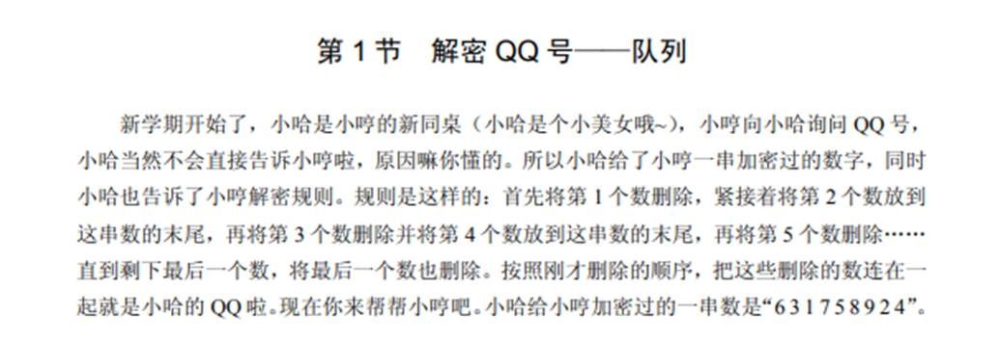
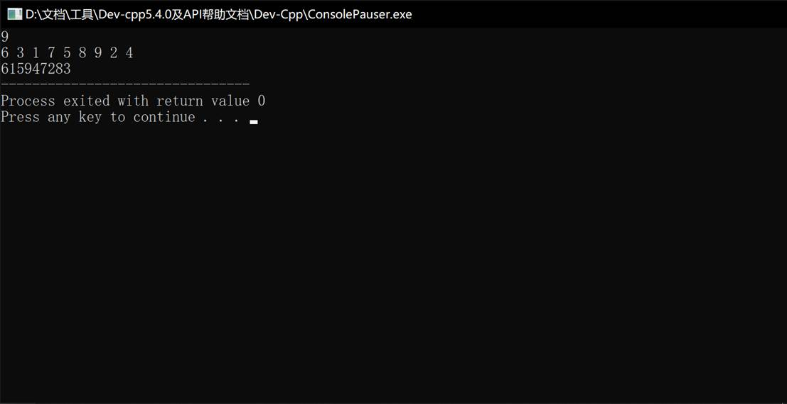
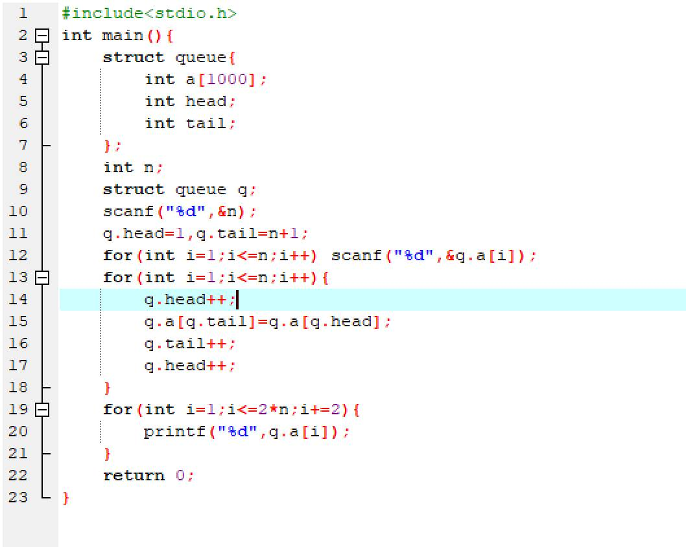
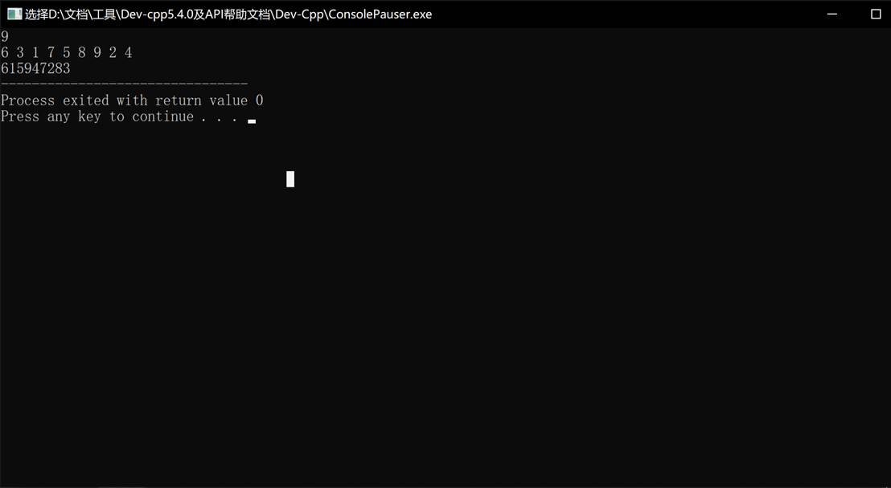

# 今日学习内容：

## 队列

### 例题



要将一串数字中第一位删除，第二位移到末尾，那么可以将数组首地址向后移动一位（此时数组中第一个元素就不存在于队列之中），

将此时首地址的值移到末尾，即将首地址的值存到末地址，再将末地址和初始地址向后移动一位。循环n次，再隔项输出即可解密。

核心代码如下：

```c++
head++;
a[tail]=a[head];
tail++;
head++;
```

全部代码如下：

```c++
#include<stdio.h>
int main(){
	int n,a[1000]={0};
	
	scanf("%d",&n);
	int  head=1,tail=n+1;
	for(int i=1;i<=n;i++) scanf("%d",&a[i]); 
	for(int i=1;i<=n;i++){
		head++;
		a[tail]=a[head];
		tail++;
		head++;
	}
	for(int i=1;i<=2*n;i+=2){
		printf("%d",a[i]); 
	}
	return 0;
}

```

运行结果如下：



运行正确

### 队列的概念

它是一种特殊的线性结构，只允许在队首进行删除（出队）和队尾进行插入（入队）（有点像军队的管理方法，所以称之为队列）。

当队列中没有元素时，即head==tail时，称之为空队列。

队列遵循的原则是“先进先出”，它不会打乱队伍原有的顺序。

用结构体能够更加直观的显示出数据结构：

结构体写法是：

```c++
struct queue{
     int a[1000];
     int head;
     int tail;
 };
```

最终代码如下：



运行结果如下：

