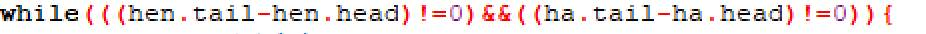

# 今日学习内容：

## 栈

### 栈的定义

与队列相反，数据只能从一端操作，先进后出，像水桶一样。

### 例题


#### 题解

由于手上的牌是从牌上方拿出放置到桌上，赢牌以后是从牌的下方放进去，这满足队列的条件（先进先出，队首插入，队尾删除）。

而桌上的牌是一个个堆在桌上，取的时候是从最上面开始逐个取出，这满足栈的数据存取方式（先进后出）。

因此定义两种数据结构，一种是手中牌的数据结构：


另一种是桌上牌的数据结构：


然后是发牌阶段：

代码如下：


由于判断赢的方式是任意一方没牌，那么结束循环的条件就是任何一个队列中没有数据（即队尾与队首下标一致）：



奇数回合是小哼出牌，偶数回合是小哈出牌，每次出完牌以后判断是否与前面的牌有一致的，有的话就将两者及其中间的牌给出牌者。

最终代码如下：


#### 代码

```c++
#include<stdio.h>
#define N 6 //每个人发到的牌数
int main(){
	////牌在手上是队列（前出后进） 
	struct queue{//队列 
		int a[1000];
		int head;
		int tail;
	};
	////牌在桌上是栈（先进后出） 
	struct zhan{//栈 
		int a[1000];
		int top;
	};
	struct queue hen,ha;
	struct zhan desk;
	int tmp;//暂存数据 
	int is_get;//能否拿到牌
	int round=0;//第几回合 
	hen.head=1,hen.tail=1;
	ha.head=1;ha.tail=1;
	desk.top=0;
	for(int i=1;i<=N;i++){
		scanf("%d",&hen.a[i]);
		hen.tail++;
	}
	for(int i=1;i<=N;i++){
		scanf("%d",&ha.a[i]);
		ha.tail++;
	}
	while(((hen.tail-hen.head)!=0)&&((ha.tail-ha.head)!=0)){
		round++;//回合加一
		if(round%2==1){//奇数回合是小哼 
			desk.top++;//桌上留出一个空放牌 
			desk.a[desk.top]=hen.a[hen.head];//让小哼把牌放上去 
			hen.head++;//小哼手里最上面的牌没了 
			is_get=0;//假设现在桌上没有相同的牌 
			for(int i=1;i<=desk.top-1;i++){
				if(desk.a[i]==desk.a[desk.top]){
					//找到了一个牌与最后一张牌一样，结束寻找 
					is_get=1;
					break;
				} 
			}
			if(is_get==1){
				tmp=desk.a[desk.top];//暂存桌上最后一位数 
				hen.a[hen.tail]=tmp;//最后一张牌放到小哼手里 
				hen.tail++;
				desk.top--;//桌上少了一张牌 
				while(desk.a[desk.top]!=tmp){//拿掉中间的牌 
					hen.a[hen.tail]=desk.a[desk.top];
					hen.tail++;
					desk.top--;
				}
			//	hen.a[hen.tail]=desk.a[desk.top];//拿掉最后一张牌 
			//	hen.tail++;
			//	desk.top--; 
			} 
		}else{//偶数回合是小哈 
			desk.top++;//桌上留出一个空放牌 
			desk.a[desk.top]=ha.a[ha.head];//让小哈把牌放上去 
			ha.head++;//小哈手里最上面的牌没了 
			is_get=0;//假设现在桌上没有相同的牌 
			for(int i=1;i<=desk.top-1;i++){
				if(desk.a[i]==desk.a[desk.top]){
					//找到了一个牌与最后一张牌一样，结束寻找 
					is_get=1;
					break;
				} 
			}
			if(is_get==1){
				tmp=desk.a[desk.top];//暂存桌上最后一位数 
				ha.a[ha.tail]=tmp;//最后一张牌放到小哈手里 
				ha.tail++;
				desk.top--;//桌上少了一张牌 
				while(desk.a[desk.top]!=tmp){//拿掉中间的牌 
					ha.a[ha.tail]=desk.a[desk.top];
					ha.tail++;
					des
					k.top--;
				}
			//	ha.a[ha.tail]=desk.a[desk.top];//拿掉最后一张牌 
			//	ha.tail++;
			//	desk.top--; 
			} 
		} 
	}
	
	if((hen.tail-hen.head)==0){
		printf("小哈 win");
	}else if((ha.tail-ha.head)==0){
		printf("小哼 win");
	}
	printf("\n小哼手里的牌：");
	for(int i=hen.head;i<hen.tail;i++){//输出小哼手里剩下的牌 
		printf("%d ",hen.a[i]);
	}
	printf("\n小哈手里的牌：");
	for(int i=ha.head;i<ha.tail;i++){//输出小哈手里剩下的牌 
		printf("%d ",ha.a[i]);
	}
	printf("\n桌上的牌：");
	for(int i=1;i<=desk.top;i++){//输出桌上剩下的牌 
		printf("%d ",desk.a[i]);
	}
	return 0;
}

```

运行结果如下:

