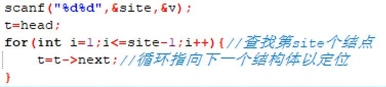

# 今日学习内容：

## 链表

### 链表的定义

可以在中间任意位置进行删除增添操作的一种线性数据结构。

在栈、队列这些数据结构中，数据的存取只在头或尾进行，灵活性很差，会浪费大量的时间，增加空间复杂度，因此使用链表对数据的操作会更加灵活。

链表可以用结构体来存放，是在内存中申请无数个零碎的结构体空间，一个变量存放数据，还有一个指针变量存储下一个结点的内存地址，从而像用链子一样将独立的存储空间连接起来，形成链表。

结构体定义标准是这样的：


由于一开始独立的链表是没有结点（链条）的，所以无法连接到下一个数据（因为没有下一个），所以要给第一个结构体的表指向的下一个结构体的地址赋值为NULL：


接下来就到了存储数据的地方：

先从键盘中获取数据，然后给p的地址申请一个结构体node大小的node结构体类型内存空间，将键盘中的数据赋值给这个空间的data空间中，因为这个结构体后面还没有下一个结构体，所以暂时不需要结点（链子），所以给他的next指针空间赋值NULL：


接下来就是判断他（p）是不是链表的首地址了，是的话就将head指针指向p，如果不是的话就将上一个结构体的next指针指向这个这个结构体，像这样：


用代码就是像这样表示：


到了输出环节，我们就要从链表首元素开始输出，每次输出完要将结构体的指针指向下一个结构体，直到没有下一个结构体为止。

代码如下：


全部代码如下：

```c++
#include<bits/stdc++.h>
int main(){
	struct node{
		int data;
		struct node *next;
	};
	struct node *q,*t,*head,*p;
	int a,i,n;
	head=NULL;
	for(i=1;i<3;i++){
		scanf("%d",&a);
		p=(struct node *)malloc(sizeof (struct node));
		p->data=a;
		p->next=NULL;
		if(head==NULL){
			head=p;
		}else{
			q->next=p;
		}
		q=p; 
	}
	t=head;
	while(t!=NULL){
		printf("%d",t->data);
		t=t->next;
	}
}

```


至于如何在链表中插入数据，只要改变指针所指向的内存即可，如下图：


先用循环来找到要插入的结点的位置：



再申请一个新的属于结构体的空间，将值放入空间，然后将这个空间的next指针指向原本的下一个结构体，像这样：


此时的结构体是这样的：


然后再将t的next指针指向新申请的p结构体空间，最后就成了这样：


实现代码如下：


最后输出：


最终代码如下：

````c++
#include<bits/stdc++.h>
int main(){
	struct node{
		int data;
		struct node *next;
	};
	struct node *q,*t,*head,*p;
	int a,i,n;
	head=NULL;
	for(i=1;i<5;i++){
		scanf("%d",&a);
		p=(struct node *)malloc(sizeof (struct node));
		p->data=a;//
		p->next=NULL;
		if(head==NULL){
			head=p;
		}else{
			q->next=p;
		}
		q=p; 
	}
	t=head;
	while(t!=NULL){
		printf("%d",t->data);
		t=t->next;
	}
	printf("\n");
	int site,v;
	scanf("%d%d",&site,&v);
	t=head;
	for(int i=1;i<=site-1;i++){//查找第site个结点 
		t=t->next;//循环指向下一个结构体以定位 
	}
	p=(struct node *)malloc(sizeof(struct node));
	p->data=v;
	p->next=t->next;
	t->next=p;
	t=head;
	while(t!=NULL){
		printf("%d ",t->data);
		t=t->next;
	}
}

````

