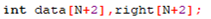
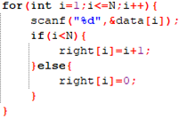
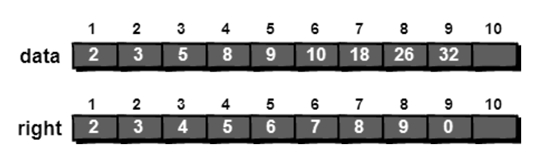
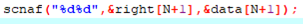
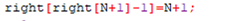
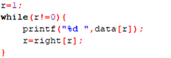
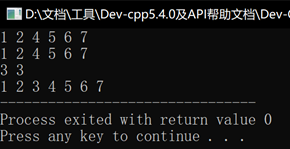
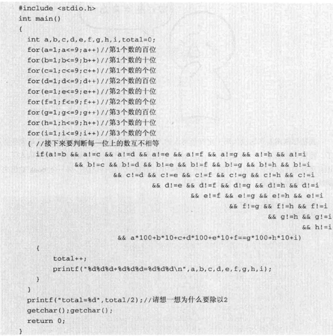
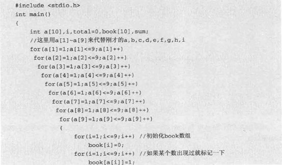
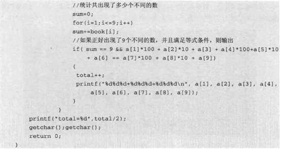

# 今日学习内容：

## 模拟链表与暴力枚举

### 1.  模拟链表：

#### 定义

使用数组及数组的下标这个属性来模拟链表这个数据结构：

模拟链表就是定义一个下标所指的为链表，用right数组来存储下一个链表的下标，虽说数组是连续的，但是经过这种操作就是使这个数组变得无序，从而方便于连接链表的结点。

首先我们定义数组data来存储数据，数组right来存储下一个结点的位置：

​                               

接着，我们循环存入数据，在存储数据的过程之中，链表的连接操作是一并完成的，在存储数据时，我们的链表是顺序的，连续的，因此我们只需指定这一个下标i对应的right指向下一个下标i+1就行了，如果存储到了最后一位，那么就定义最后一位的right指向的下标为0，但是0下标并不在我们的定义范围之内，所以他就是指向空的，具体代码如下：

 

在这里，数据是这样存储的：

 

（图中是9个数据，我们的代码是6个数据，无伤大雅）

那么我们该如何插入一个数据到中间呢？

之前我们说过，一个链表在内存空间中的存储方式是混乱的，无序的，所以我们在使用数组来存储链表的时候，我们也无序考虑数据在数组中的位置，直接在数组末尾插入即可。

所以，先输入要插入的位置与要插入的数据，代码如下：

 

接下来，只需要把要插入的位置的上一位链表的right指向刚刚插入的数据，刚刚插入的链表的right指向原本的下一位链表，代码如下，因为我们刚刚输入时已经完成了后面的一步（刚刚插入的链表的right指向原本的下一位链表），所以我们只需要再将前一个链表的right指向原本的下一个链表就可以了，即：

 

输出：

 

运行结果如下：

 

最终代码如下：

```c++
#include<stdio.h>
#define N 6
int main(){
   int data[N+2],right[N+2];
   for(int i=1;i<=N;i++){
      scanf("%d",&data[i]);
      if(i<N){
         right[i]=i+1;
      }else{
         right[i]=0;
      }
   }
   int r=1;
   while(r!=0){
      printf("%d ",data[r]);
      r=right[r];
   }
   printf("\n");
   scanf("%d%d",&right[N+1],&data[N+1]);
   right[right[N+1]-1]=N+1;
   r=1;
   while(r!=0){
      printf("%d ",data[r]);
      r=right[r];
   }
   return 0;
} 

```

### 2.  暴力枚举

#### 定义

枚举，顾名思义，就是一个个列举，现实生活中很多问题当然是没有办法靠我们枚举出来的（精力不足），但是在计算机中，使用计算机的强大算力，很多问题都可以迎刃而解。

但是枚举并不是无头脑的枚举，很多时候算法的选择是可以优化代码的，如：

 

这样的代码会让人眼花缭乱（虽然思路真的很清晰），但是如果我们使用标记法，那么代码就舒服了很多：

 

 

它的原理就是通过将每个出现的数存储到以这个数为下标的book数组元素中，即出现这个数就存储为1表示这个数出现过，最后判断是不是每个元素都是1，是的话就说明没有重复的数。

 