# 今日学习内容：

## 暴力枚举与深度优先搜索

### 例题1

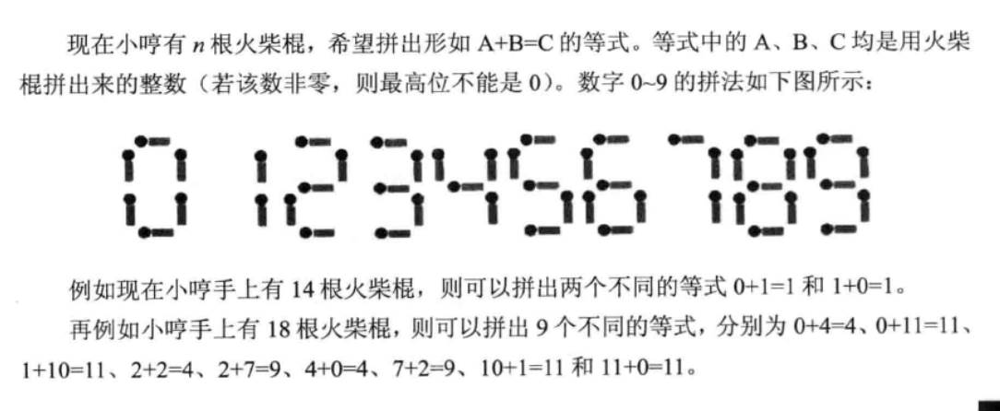

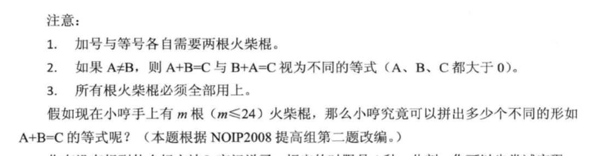

分析题目，我们想出了完成程序第一个步骤：打表

将每个数字对应的火柴数存在一个一维数组之中以待使用：

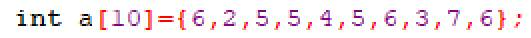

（其下标就是对应的数字）

接下来的问题是，如何得出一个数所需的火柴数目？

我们只要先对这个数对10取余，然后去表中找对应的数，再将原来的数除以10，直到这个数每位都存好了为止。于是代码如下：

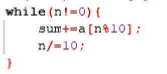

但是我们会发现一个问题，如果这个数是0，那么对应的结果应该是6，可实际上，这个代码运行的结果是1，那么我们就给它的特殊情况加一个判断：

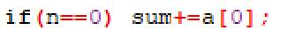

继续分析，火柴数不超过24根，去除掉+和=，组成数火柴的数量不应该超过20。而需要火柴数最少的是数字1，每个1需要两个火柴。那么在等号左边最多有10个1，可是若左边有10个1，右边也必定至少有10个1，不成立，所以左边最多有5个1，但是我们必须保证，左边的+好两边都有数，所以这5个1肯定得分在+好两边，所以左边每个加数上最多有4个1，即每个数小于等于1111，那么我们就确定了循环的范围：0-1111.

代码如下：

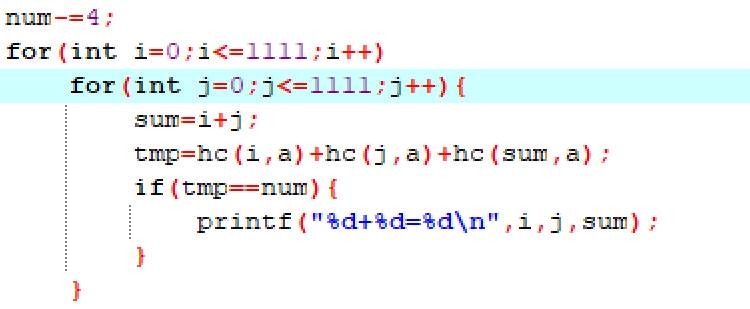

运行结果如下：

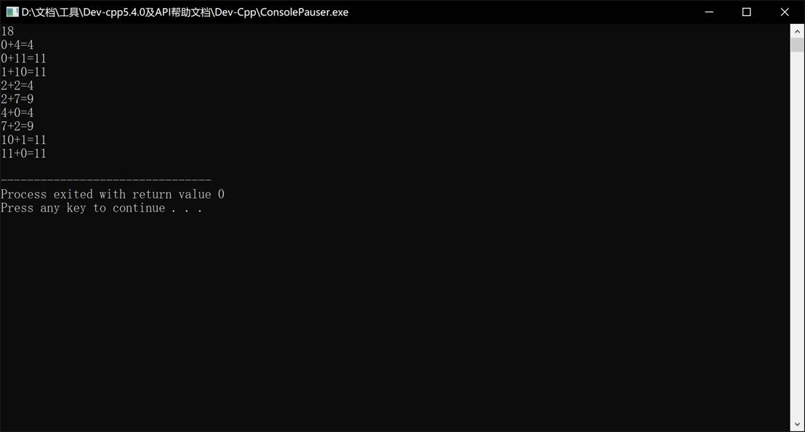

最终代码如下：

```c++
#include<bits/stdc++.h>
int hc(int n,int a[]){
    int sum=0;
    if(n==0) sum+=a[0];
    while(n!=0){
        sum+=a[n%10];
        n/=10;
    }
    return sum;
}
int main(){
    int a[10]={6,2,5,5,4,5,6,3,7,6};
    int num,sum,tmp;
    int a_l,b_l,c_l;
    scanf("%d",&num);
    num-=4;
    for(int i=0;i<=1111;i++)
        for(int j=0;j<=1111;j++){
            sum=i+j;
            tmp=hc(i,a)+hc(j,a)+hc(sum,a);
            if(tmp==num){
                printf("%d+%d=%d\n",i,j,sum);
            }
        }
    return 0;
}
 
```

### 例题2（深度优先搜索）

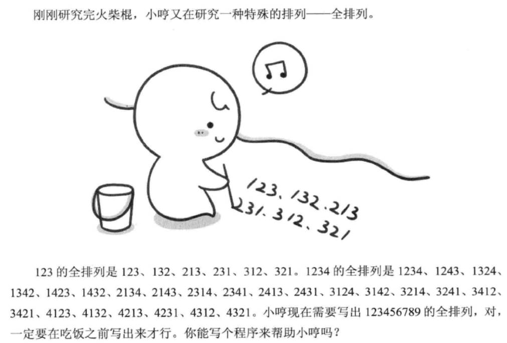

这道题，如果直接使用暴力枚举，会出现许多的for循环，让人眼花缭乱，而且，暴力枚举只能解决一个大小的数的枚举，无法作为通解，所以，这一题我们使用“深度优先搜索”来完成。

首先，深度优先算法的核心是：“这步该怎么做”以及“进入下一步”还有“退回上一步”。

就如下方所写：

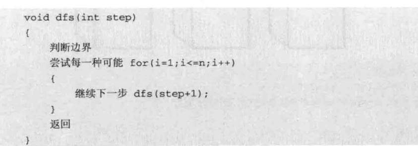

我们先写一个函数，传入参数为step（第几步）:

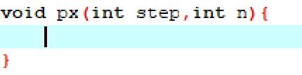

接着，我们应该尝试每一种存放方式，当然，如果牌已经出手了，那么我们就无法放入面前的箱子了：

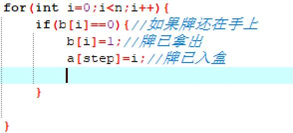

接下来我们走到下个箱子，接下来的步骤我们就不用思考了，因为我们的任务只是要思考：当前步骤，进入下一步，和回退到上一步，那么如何回退到上一步呢？其实很简单，只要把原来那个箱子里面的牌拿回来到手上就可以了：

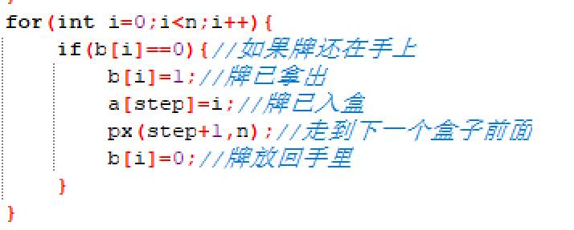

接下来的问题就是何时输出了，输出时，我们应该刚刚放完最后一个盒子，正站在一个虚拟的第n+1个盒子面前，那么这就应该是我们的最后一步了，前面全部放完了，那么这个时候就该输出了：

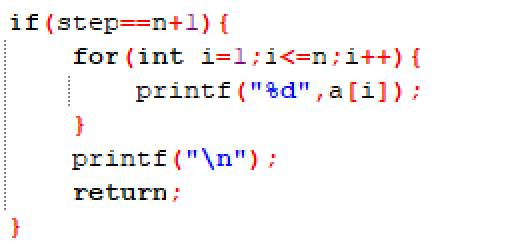

输出完呢？因为我们已经没有下一步了，所以我们在输出结束后要用return结束这个步骤，否则我们就会无限循环，虽说后面没有盒子了，他还是会寻找到其他虚拟的盒子继续操作下去的。

运行结果如下：

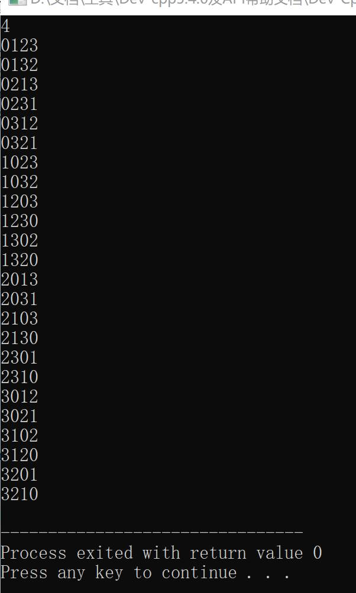

完整代码如下：


```c++
#include<stdio.h>
#define N 10
int a[N+1],b[N+1]={0};
void px(int step,int n){
   if(step==n+1){
      for(int i=1;i<=n;i++){
         printf("%d",a[i]);
      }
      printf("\n");
      return;
   } 
    for(int i=0;i<n;i++){
       if(b[i]==0){//如果牌还在手上 
          b[i]=1;//牌已拿出 
           a[step]=i;//牌已入盒
          px(step+1,n);//走到下一个盒子前面
          b[i]=0;//牌放回手里 
       } 
    }
}
int main(){
   int  n;
   scanf("%d",&n);
   px(1,n);
   return 0;
} 
```

 