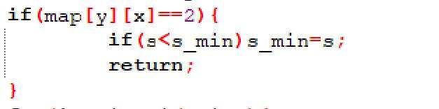

# 今日学习内容：

## 深度搜索算法的进一步使用

### 例题


为了方便，我们先用打表来存储四种方向：


用二维数组map存储我们输入的地图，用二维数组book标记走过的点：


（注意：这些都是定义在函数外的全局变量，这样便于操作）

接下来就是循环录入数据：


根据深度搜索算法，我们应该定义一个函数用以递归，那么我们应该思考的是，这个函数所进行的当前步骤，进入下一步和返回上一步。

首先是当前步骤，因为我们需要四个方向不断尝试，而刚刚我们已经将方向的数据存储在了二维数组dir中，所以四种尝试是这样完成的：


（完成这一步操作以需要退回上一步，所以要返回上一步的坐标）

接下来我们该解决的是如何进入下一步，我们需要知道，进入下一步的条件是什么，进入下一步的条件是下一个空没有超出边界，而且下一步没有撞到障碍物，我们在录入地图数据的时候已经将障碍物用1表示了，所以我们判断能否进入下一步的判断语句是：


我们进入了下一步以后，我们下一步的操作肯定是不能往上一步走过的地方走的，那样程序就会陷入死循环（在原地来回走动），所以我们需要把当前步骤的位置先标记一下，告诉计算机，这边走过了，不能再走了：


然后我们进入下一步：


再返回上一步的时候，我们还需要去除掉标记：


所以循环中的代码如下：


那么只进行这样的操作，我们确实是把整个地图走了一遍，可是我们并没有完成我们的目的：找到小哼，在输入操作完成以后，我们已经把小哼所在的地方标记为了2：


因此，我们需要把每次找到小哼的路径记录下来，取最小值，代码如下：



> （s_min是函数体外定义的全局变量）

至此，我们在主函数中调用这个寻找路径的函数时，只需要把初路程设置成0就可以了，那么运行结果如下：


```c++
#include<bits/stdc++.h>
int dir[4][2]={{1,0},{0,1},{-1,0},{0,-1}};
int map[40][40];
int book[40][40]={0}; 
int s_min; 
int m,n;
void dw(int x,int y,int s){
   if(map[y][x]==2){
         if(s<s_min)s_min=s;
         return;
   }
   for(int i=0;i<4;i++){
      x+=dir[i][0];
      y+=dir[i][1];
      if(x>=1&&x<=n&&y>=0&&y<=m&&map[y][x]!=1&&book[y][x]==0){
         book[y][x]=1;
         dw(x,y,s+1);
         book[y][x]=0;
      }
      x-=dir[i][0];
      y-=dir[i][1];
   }
}
int main(){
   int in_x,in_y;
   int ha_x,ha_y;
   scanf("%d%d",&m,&n);
   s_min=m*n;
   for(int i=1;i<=m;i++){
      for(int j=1;j<=n;j++) scanf("%d",&map[i][j]);
   }
   scanf("%d%d%d%d",&in_x,&in_y,&ha_x,&ha_y);
   book[in_y][in_x]=1;
   map[ha_y][ha_x]=2;
   dw(in_x,in_y,0);
   printf("%d",s_min);
   return 0;
}

```

