# 今日学习内容：

## 广度优先算法

前两天学习了深度优先搜索算法，深度优先算法是每次完成一系列操作以后返回上一步换种情况继续进行一个个尝试的操作，这种算法是将每一次可能的情况都进行了尝试，从而寻求最优解。

而今天学习的广度优先算法，是将每一个路程长度作为一种情况进行尝试，碰到符合要求的情况就结束尝试，因此这种算法不一定会尝试所有操作，因此，这种算法的时间复杂度相较于深度优先搜索算法要低一些。

首先，我们这道题是用队列来进行操作的，先定义一个结构体来存储队列，其中每个数据所代表的意思在注释中标出：

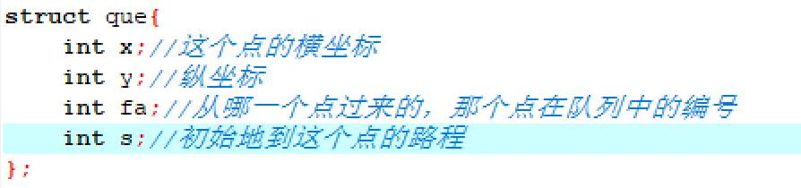

和深度优先搜索算法一样，我们先将方向存入二维数组便于操作：

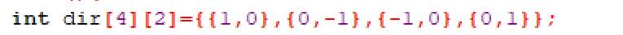

接下来就是定义一些数据，作用在注释中：

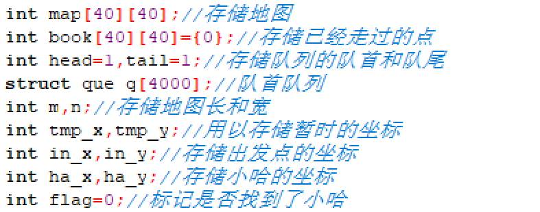

常规的数据输入：

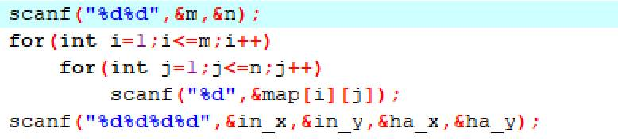

这时候，已经有了出发点的坐标，我们让这个坐标作为队列的队首，此时因为在出发点，所以行走的路程为0，没有上一个起始点：

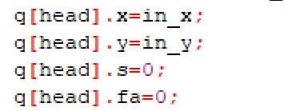

顺便的，我们将小哈的坐标标记为2，便于寻找，并将队尾加一，便于下一个数据的录入，而此时，出发点肯定是我们已经走过的点，所以我们给他做个标记：

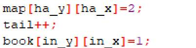

那么现在我们就应该思考每一步该干什么了，首先，我们肯定是要从四个方向开始出发寻找点的。那么开始循环，往四个方向开始寻找：

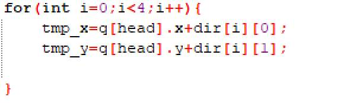

那么向下寻找肯定是需要条件的，那么条件就是没有超过边界，下一个点没有被标记，而且下一个点不是障碍物，判断往这个点走的条件是这样的：

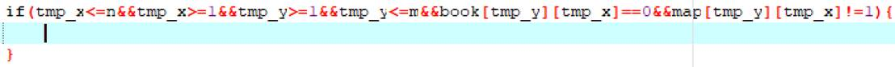

那么既然已经走到了下一个点，我们就该给这点做上标记，而且要将这个点归纳到队列中，便于后面再从这点出发开始寻找，标记完以后，我们还应该知道，到这个点距离出发点走了几步路程，路程就是上一个点距离出发点的路程加一，我们还要把从从哪个点出发也标记一下，也就是说要标记父点，之后队列的队尾要加一，便于下一个队列元素的存储：

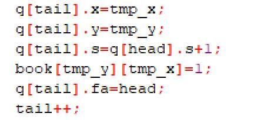

当然，存储完这些数据以后我们还应该思考我们的目的，我们的目的是寻找小哈，所以如果下载我们走到的这个点就是小哈所在的点，那我们就已经找到了距离小哈最近的距离了，那么我们就应该结束寻找了：

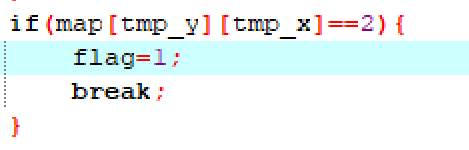


哦对了，我们目前只是完成了从上一个点到下一个点的过程，可是同样路程的点可不止一个，所以我们要把队列最前面那个已经用完不可能再用的点删除了，就是删除队首：

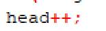

我们还有一种情况，我们可能是无法寻找到小哈的（小哈被障碍物包起来了），那么我们是不可能让程序进入死循环的，那么我们该如何结束循环呢？其实很简单，我们总有一次会将整个地图搜索完的，这个时候所有点都已经无处可去了，也就是说，tail++这个指令必定会在某一步开始不再进行了，可是head++的执行并没有限制，所以如果找不到小哈，我们搜完整个地图以后，总有一个时候，head的值会赶上tail的值，这个时候，我们就可以结束整个循环：

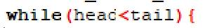

当我们实在找不到小哈时，flag的值是0：

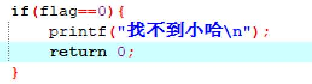

如果找到小哈呢？我们就可以输出找到小哈最近的距离：

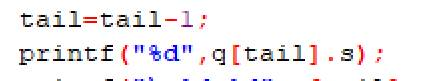

（注意：我们目前的队尾是一个空值，没有存储任何数据，上一个tail才是找到小哈时的数据）

我们在上面还标记了每次步骤的父点的编号，所以借此，我们可以追踪寻找小哈最短距离的轨迹：

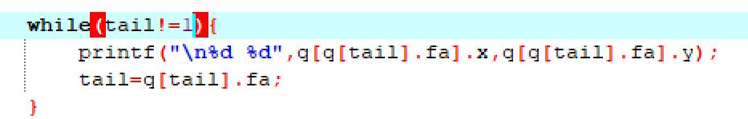

整个程序运行结果如下：

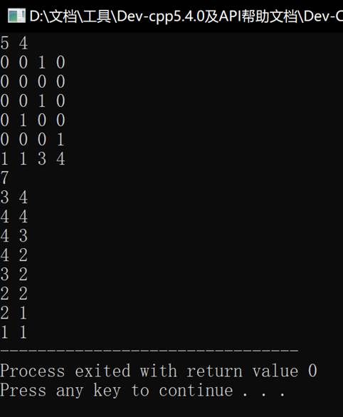

整个程序代码如下：

```c++
#include<stdio.h>
struct que{
   int x;//这个点的横坐标 
   int y;//纵坐标 
   int fa;//从哪一个点过来的，那个点在队列中的编号 
   int s;//初始地到这个点的路程 
};
int main(){
   int dir[4][2]={{1,0},{0,-1},{-1,0},{0,1}};
   int map[40][40];//存储地图 
   int book[40][40]={0};//存储已经走过的点 
   int head=1,tail=1;//存储队列的队首和队尾 
   struct que q[4000];//队首队列 
   int m,n;//存储地图长和宽 
   int tmp_x,tmp_y;//用以存储暂时的坐标 
   int in_x,in_y;//存储出发点的坐标 
   int ha_x,ha_y;//存储小哈的坐标 
   int flag=0;//标记是否找到了小哈 
   scanf("%d%d",&m,&n);
   for(int i=1;i<=m;i++)
       for(int j=1;j<=n;j++)
           scanf("%d",&map[i][j]);
   scanf("%d%d%d%d",&in_x,&in_y,&ha_x,&ha_y);
   q[head].x=in_x;
   q[head].y=in_y;
   q[head].s=0;
   q[head].fa=0;
   map[ha_y][ha_x]=2;
   tail++;
   book[in_y][in_x]=1;
   while(head<tail){
      for(int i=0;i<4;i++){
         tmp_x=q[head].x+dir[i][0];
         tmp_y=q[head].y+dir[i][1];
         if(tmp_x<=n&&tmp_x>=1&&tmp_y>=1&&tmp_y<=m&&book[tmp_y][tmp_x]==0&&map[tmp_y][tmp_x]!=1){
            q[tail].x=tmp_x;
            q[tail].y=tmp_y;
            q[tail].s=q[head].s+1;
            book[tmp_y][tmp_x]=1;
            q[tail].fa=head;
            tail++;
         }
         if(map[tmp_y][tmp_x]==2){
            flag=1;
            break;
         }
      }
      if(flag==1) break;
      head++;
   }
   if(flag==0){
      printf("找不到小哈\n"); 
      return 0;
   }
   tail=tail-1;
   printf("%d",q[tail].s);
   printf("\n%d %d",q[tail].x,q[tail].y); 
   
   while(tail!=1){
      printf("\n%d %d",q[q[tail].fa].x,q[q[tail].fa].y);
      tail=q[tail].fa;
   }   
   return 0;
}
```

