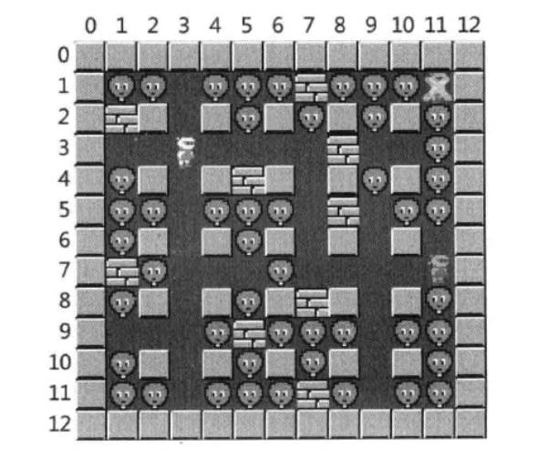
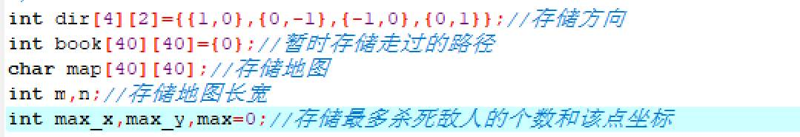
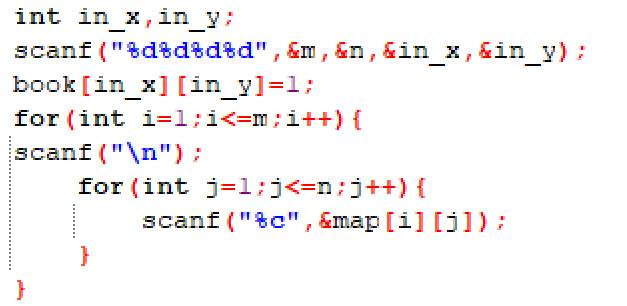
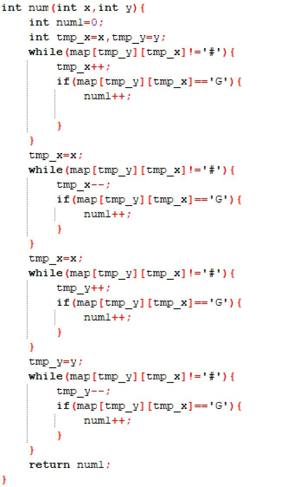
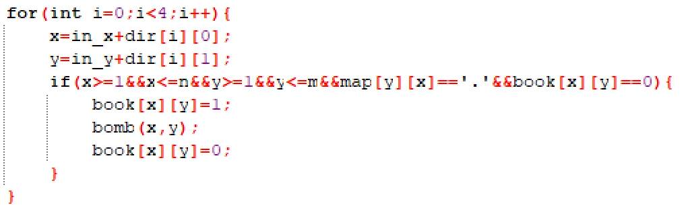
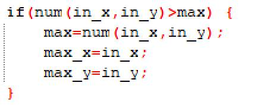
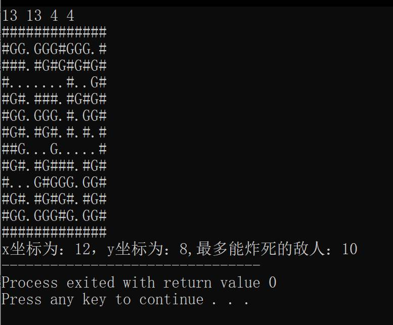

# 今日学习内容：

## 用深度优先算法解炸弹人

### 题目

找到能走到的一个能够炸死最多敌人的一个点：



解炸弹人其实可以选用深度优先算法也可以选用广度优先算法，但是毕竟不是找最短路径，而是找最优点，不要求我们找出最短的距离，只要求尝试每一个可能的点就行了，所以使用深度优先搜索算法。

首先是常规的数据定义：



然后是输入：



> （注意：我们在输入地图时会有\n的干扰，所以用scanf(“\n”)来屏蔽掉换行符）

然后，我们编写一个函数来确定某个爆炸点能炸死多少敌人，这个函数分为向上，向下，向左，向右四个步骤搜索，然后返回能炸到的敌人数，具体函数如下：



接着就是深度优先搜索的核心代码了：



每次在一个点向四个方向走，如果一个点可以走就顺着这个点继续走下去，最后找完以后再返回，但是，我们要遍历所有能走到的地方，所以这里没有循环停止的条件，对了，每次走到一个点就要把这个点标记一下，否则会重复搜索的。

最后是每一步都要执行判断，这个点是不是能炸死敌人最多的点：



最后代码运行如下：



最终代码如下：

```c++
#include<stdio.h>
/*测试数据：
13 13 4 4
#############
#GG.GGG#GGG.#
###.#G#G#G#G#
#.......#..G#
#G#.###.#G#G#
#GG.GGG.#.GG#
#G#.#G#.#.#.#
##G...G.....#
#G#.#G###.#G#
#...G#GGG.GG#
#G#.#G#G#.#G#
#GG.GGG#G.GG#
#############
*/
int dir[4][2]={{1,0},{0,-1},{-1,0},{0,1}};//存储方向 
int book[40][40]={0};//暂时存储走过的路径 
char map[40][40];//存储地图 
int m,n;//存储地图长宽 
int max_x,max_y,max=0;//存储最多杀死敌人的个数和该点坐标 
int num(int x,int y){
    int num1=0;
    int tmp_x=x,tmp_y=y;
    while(map[tmp_y][tmp_x]!='#'){
        tmp_x++;
        if(map[tmp_y][tmp_x]=='G'){
            num1++;

        }
    }
    tmp_x=x;
    while(map[tmp_y][tmp_x]!='#'){
        tmp_x--;
        if(map[tmp_y][tmp_x]=='G'){
            num1++;
        }
    }
    tmp_x=x;
    while(map[tmp_y][tmp_x]!='#'){
        tmp_y++;
        if(map[tmp_y][tmp_x]=='G'){
            num1++;
        }
    }
    tmp_y=y;
    while(map[tmp_y][tmp_x]!='#'){
        tmp_y--;
        if(map[tmp_y][tmp_x]=='G'){
            num1++;
        }
    }
    return num1;
}
void bomb(int in_x,int in_y){
    int x,y;
    if(num(in_x,in_y)>max) {
        max=num(in_x,in_y);
        max_x=in_x;
        max_y=in_y;
    }
    for(int i=0;i<4;i++){
        x=in_x+dir[i][0];
        y=in_y+dir[i][1];
        if(x>=1&&x<=n&&y>=1&&y<=m&&map[y][x]=='.'&&book[x][y]==0){
            book[x][y]=1;
            bomb(x,y);
            book[x][y]=0;
        }
    }
}
int main(){
    int in_x,in_y;
    scanf("%d%d%d%d",&m,&n,&in_x,&in_y);
    book[in_x][in_y]=1;
    for(int i=1;i<=m;i++){
        scanf("\n");
        for(int j=1;j<=n;j++){
            scanf("%c",&map[i][j]);
        }
    }
    bomb(in_x,in_y);
    printf("x坐标为：%d，y坐标为：%d,最多能炸死的敌人：%d",max_x,max_y,max);
    return 0;
} 

```

